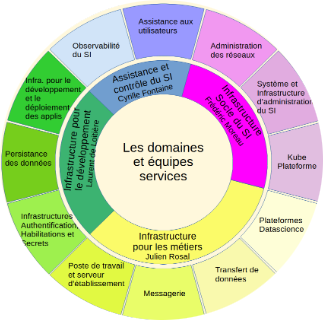
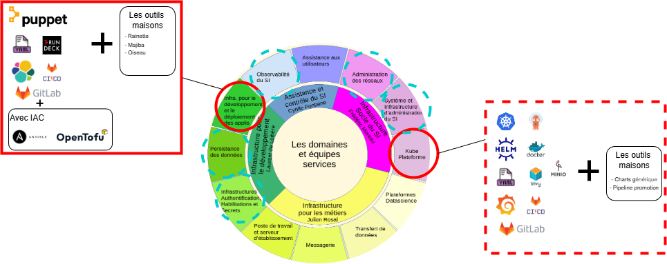
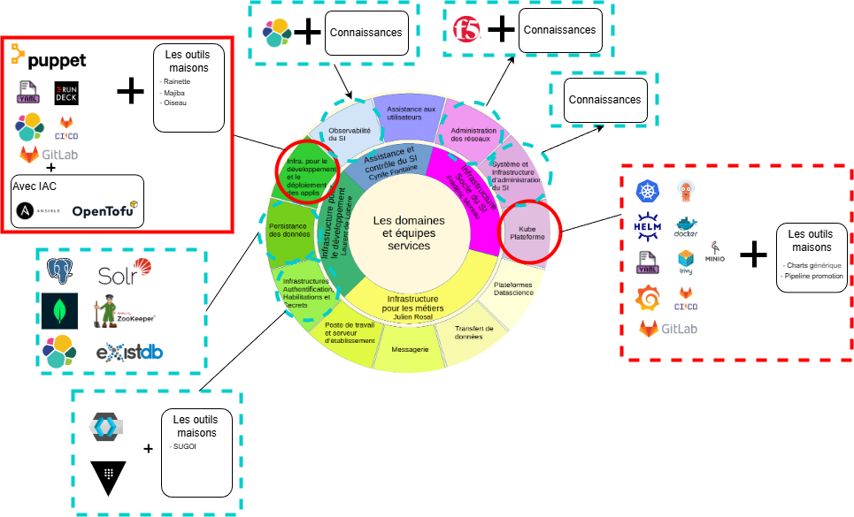
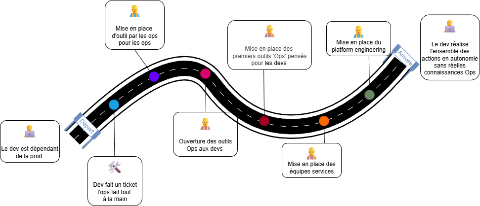

# Platform Engineering

c'est quoi ce nouveau truc ?

---

## Retour vers le passé

---

### Mise en place de la CI

- Quand ? Il y a fort longtemps (`2017 - Gitlab Innovation`)
- Quoi ? Automatisation du build/test/delivery
- Comment ? Jenkins, Gitlab, implémentation propre à chaque projet

➡️ Des pratiques CI/CD différentes entre équipes, héritées du passé de chaque devs.

---

### Ouverture des droits Ops au dev

- Quand ? Lors de la migration Telis -> Osny/Auzeville (`2020/2021`)
- Quoi ? Permettre aux développeurs de réaliser les tâches d'OPs simple
- Comment ? Donner le droits au dev de faire ce que faisait les ops

➡️ Un nouveau métier les devs-intégrateurs, une ouverture des services utilisés par les ops aux devs

---

### Transformation DevOps

- Quand ? Depuis la mise en place Puppet6 (`2020/2021`)
- Quoi ? Modernisation des outils de déploiement/ création d'environnement / Apparition de Kubernetes
- Comment ? Mise en place de service ops orienté dev expériences.

➡️ Casser la barrière Dev et Ops. Un temps de déploiements réduit de plusieurs semaines à quelques heures.

---

## Passage aux équipes Services

- Quand ? C'était il y a 2 ans (`2024`)
- Quoi ? Donner une autonomie aux Ops sur la conception de leur service offert au dev pour mieux au répondre à leurs besoins.
- Comment ? Mise en place d'équipes services à la prod

➡️ Disparition des RIAPs

---

## Des constats (1/3)

➡️ Beaucoup d'interlocuteur différents

---

## Des constats (2/3)

Beaucoup de technos différentes

---

## Des constats (3/3)

😕 Vraiment beaucoup de technos différentes
☁️ Un jour: le Cloud

---

## Des objectifs différents

- 2 métiers différents ➡️ des objectifs différents :

| Dev                                         | Ops                                                                 |
| ------------------------------------------- | ------------------------------------------------------------------- |
| - Produire de nouvelles features rapidement | - Assurer la stabilité des applications / infrastructures déployées |

---

## Des contraintes différentes

| Dev                                      | Ops                                       |
| ---------------------------------------- | ----------------------------------------- |
| - limités par la complexité des outils   | - Beaucoup de devs à accompagner          |
| - migrations et majs des stacks des ops  | - Tâches pas encore automatisées          |
| - choix techniques des ops non maitrisés | - choix techniques des devs non maitrisés |

---

## Parcours dev nouvelle appli ♨️ (exemple java sur kubernetes) 

- 👨🏻‍💻 Configuration appli avec SpringInitlizr
- 👨🏻‍💻 Téléchargement et dézippage du template de base
- 👨🏻‍💻 Création d'un dépôt de code applicatif
- 👨🏻‍💻 first commit (de code) 🚀

➡️ Mais j'ai juste un dépôt de code vide

---

## et ca continue

- 👨🏻‍💻 Configuration du gitlab-ci dédié au CI (build/test unitaire/intégration, sonar, analyzer,...) ~= 50lignes de code
- 👨🏻‍💻 Création du dockerfile java ~= 5 à 20 lignes de code
- 👨🏻‍💻 Configuration CI pour construction/scan/release de l'image ~= 20
- 👨🏻‍💻 mise en place renovate + configuration

➡️ J'ai un dépôt de code vide mais automatisé 💪

---

## Encore (Déployons en dev)

- 📝 Demande de namespace à kubeapp sur kubedev (namespace + s3 + quotas) ~= Ticket
- 📝 Demande client Keycloak IAHS ~= Ticket
- 📝 Demande accès vault ~= Ticket
- 👨🏻‍💻 Création du dépôt gitops ~= plein de fichier
- 👨🏻‍💻 Configuration des manifests de mon appli (chart générique) ~= 100 lignes de codes

* BDD + application sugoi + microsegmentation + ... 
---

## Et encore (Déployons en prod)

- 📝 Ticket Demande de namespace à kubeapp sur Kubeprod ~= Ticket
- 📝 Demande client Keycloak IAHS Prod ~= Ticket
- 📝 Demande accès vault Prod ~= Ticket
- 👨🏻‍💻 Configuration des manifests de mon appli (chart générique) ~= 100 lignes de codes
- 👨🏻‍💻 Ajout du code du pipeline de promotion ~= 10 lignes de codes
- 👨🏻‍💻 Gestion des CVEs ~= ca dépends
- Mon Appli tourne en prod 🚀

---

## DevOps ?

- La théorie:

> You build it, you run it

 
 

- En pratique:
  > You build it, you configure 25 outils, et peut-être you run it 🤯

---

## Conséquences

Pour les devs:

- Charge coginitve 📈:
  - ➕️ infra
  - ➖️ devéloppement
- Duplication 📈
- Onboarding 📉

---

## Conséquences

Pour les ops:

- Temps de support 📈
- Moins de temps pour le build 📉
- Non adoption de certaines nouveautés 😭

---

### Platform engineering: définitions

> Platform Engineering can act as a barrier against the chaos of tools, tasks, and information. By standardizing tools and processes, it can liberate developers from the burden of becoming tool experts so that they can focus on their core strengths: writing great code and making exceptional products

_2024 State of DevOps Report: The Evolution of Platform Engineering_

---

### Un accomplissement du DevOps

---

### Objectifs principaux

- **Self-service** : Les développeurs peuvent provisionner ce dont ils ont besoin sans ouvrir de ticket
- **Abstraction** : La complexité sous-jacente est cachée derrière des interfaces simples
- **Golden Paths** : Des chemins balisés qui intègrent les bonnes pratiques par défaut
- **Produit, pas projet** : La plateforme est traitée comme un produit avec ses utilisateurs (les développeurs)

---

### Ce que ce n'est pas

- **Pas juste un nouvel outil DevOps** : c’est une approche globale.
- **Pas un remplacement des équipes dev ou ops**: la platforme s'appuie sur les outils proposés et utilisés par chacun.
- **Pas seulement Kubernetes ou VM** : ce sont des composants, pas la plateforme entière.
- **Pas une rigidité** qui empêche l’innovation : flexibilité et autonomie restent clés.

---

### Exemple (1/2): Sans plateforme

Jour 1 d’un nouveau développeur :

    - Demander les accès / trouver la documentation / lien vers services existant (3 jours d’attente)
    - Comprendre comment créer un nouveau service (documentation dispersée)
    - Copier-coller depuis un service existant
    - Adapter les 42 fichiers de configuration
    - Demander de l’aide sur Tchap 15 fois à 5 équipes différentes
    - Premier déploiement après 3 semaines

Création d’un nouveau microservice :

    - 2-3 semaines de configuration avant d’écrire une ligne de code métier
    - Configuration unique, difficile à maintenir
    - Oublis fréquents (monitoring, sécurité, logging)

---

### Exemple (2/2): Avec plateforme

Jour 1 d’un nouveau développeur :

    - Se connecter au portail développeur (platform-engineering)
    - Accès automatiquement provisionnés
    - Parcourir les templates disponibles
    - Créer un service depuis un template
        - validation des besoins
        - respect norme insee, urbanisation
    - Commencer à coder
    - Premier déploiement en quelques minutes

Création d’un nouveau microservice :

    - 30 minutes via le portail self-service
    - Configuration standardisée et maintenable
    - Monitoring, sécurité, logging inclus par défaut

---

### Ce que ce ne sera pas

- Un catalogue figé
- Un outil sans controle: finops / normes / standards / cohérence besoins/ressources
- Plus besoin de connaissances, plus de responsabilités

> La plateforme réduit la complexité inutile, elle n'élimine pas la responsabilité technique.

---

### Captation besoin

- 🎤 Interview : Identifier les pratiques, capter vos irritants, ouvert à tous, familier avec l'offre des Ops ou pas, legacy ou nouvelle appli. (Nantes le 24/03, les autres à venir)
- En informel ☕ / zoom 📞 / tchap ✉︎
