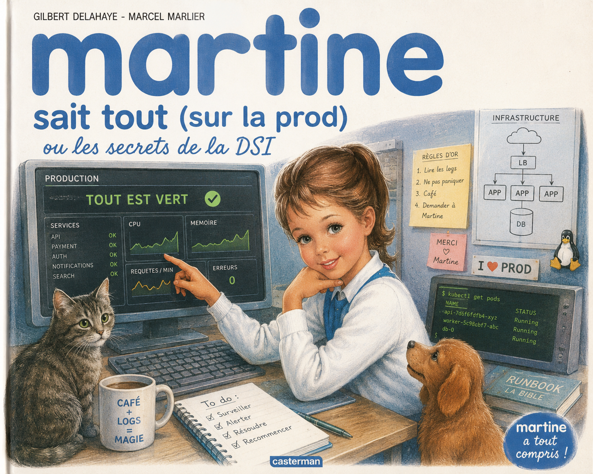

<!-- _class: lead -->
<!-- _paginate: false -->
<!-- _header: "" -->

# 🚀 Platform Engineering à l'Insee

## Ou comment on a découvert que "je demande à Martine" n'est pas une architecture scalable

---

# 📋 Sommaire

1. **La démarche** — Comment on s'y est pris *(spoiler : on est sortis du bureau)*
2. **Les irritants** — Ce qui fait grincer des dents les devs
3. **Les profils utilisateurs** — Qui sont nos développeurs ?
4. **Les cas d'utilisation** — Les Golden Paths qu'on veut leur proposer
5. **Démo live** — On arrête de parler, on montre

---

<!-- _class: titre-partie -->

# 🗺️ PARTIE 1 — La démarche terrain

## "On a pris le train pour aller écouter et parler avec des gens"

---

# La mission

Comprendre les **besoins réels** des développeurs concernant :

- Le CI/CD
- La configuration d'environnements
- Le déploiement
- Le MCO / MCS
- L'observabilité

<div class="clash">j'aurais pu envoyer un Google Form et rester au chaud.<br/>Mais j'ai préféré vous parler en direct.</div>

---

# 3 méthodes pour capturer le besoin

| Méthode | Quoi | Combien |
|---------|------|---------|
| 🎤 **Interviews** | Entretiens individuels en face-à-face | 8 personnes |
| 🎮 **Focus Groupes** | Simulation de delivery en atelier | 4 SNDI |
| 📊 **Sondage** | Questionnaire DevExp | En complément |

<div class="clash"> - Une démarche UX de la SNCF 🚂 <br/> - Une expérimentation des retards, des annulation du train et des magasins relay en gare.<br/></div>

---

# 🗺️ Le tour de France des SNDI

- 🏠 **SNDIL** — Lille *(les meilleures bières)*
- 🏠 **SNDIN** — Nantes *(les meilleures galettes)*
- 🏠 **SNDIP** — Paris *(les meilleurs croissant)*
- 🏠 **SNDIO** — Orléans *(les meilleurs douceurs)*

**Profils ciblés par SNDI :**

- 1 dev junior *(celui qui découvre que "la prod" n'est pas un concept abstrait)*
- 1 dev applicatif fullstack *(celui qui veut juste coder tranquille)*

<div class="clash">Total : 9 interviews + 4 focus groupes = 47 cafés, plusieurs heures de délais de routes et 1 crise existentielle.</div>

---

# 🎤 Les interviews — Le divan du développeur

**Objectif** : Comprendre les pratiques, besoins et frustrations.
**Format** : Entretien semi-directif, ~1h, en face-à-face.

**On a parlé de :**
- Leur journée type *(spoiler : ça commence par "je vérifie que rien n'a planté cette nuit")*
- Leurs outils au quotidien *(spoiler : IntelliJ + Stack Overflow + Tchap)*
- Ce qui les fait rager
- Ce dont ils rêvent *(spoiler : moins de prod dans leur vie)*

<div class="clash">Ambiance : digne d'une enquête criminelle.</div>

---

# 🎮 Focus Groupes — Le "Platform Engineering Game"

**Principe** : Chaque équipe est une team Produit qui doit livrer une feature. Le plus vite possible.

---

### Round 1 — Le monde SANS plateforme 😱

Les équipes passent par chaque étape du delivery (dev → build → test → deploy → run).
On introduit des **événements perturbateurs** :

- 🟥 *"GitLab CI KO"* — retour case départ
- 🟥 *"Vault inaccessible"* — retour case test
- 🟥 *"Demande KubeApp lente : +60 min"* — allez prendre un café. Un long café.
- 🟥 *"Logs introuvables"* — ouvrez un ticket, attendez 1 jour
- 🟥 *"Nouveau développeur arrive"* — attendez 1 tour (onboarding)

<div class="clash">On appelle ça le "chaos engineering". Eux ils y retrouvent leur quotidien.</div>

---

# 🎮 Focus Groupes — Round 2

### Round 2 — Le monde AVEC plateforme 🌈

Même objectif, mais l'équipe choisit **2-3 capabilities** de plateforme :

- 🟩 Golden Path (template applicatif complet)
- 🟩 CI/CD Pipeline Standard
- 🟩 Self-Service Infrastructure
- 🟩 GitOps prêt à l'emploi
- 🟩 Observability by Default

**Résultat** : le temps de delivery chute drastiquement.

<div class="clash">Les yeux des devs quand ils réalisent que c'est possible : 🤩</div>

---

# 📊 Résultats de la démarche

Ce qu'on a récolté :

- **9 irritants majeurs** classés par priorité
- **3 personas** structurants
- **16 cas d'utilisation** concrets
- **Des verbatims d'anthologie** *(voir slides suivantes)*

Et surtout : une vision claire de ce que la plateforme doit devenir.

<div class="clash">Des connaissances approfondies des gares de Nantes, Lille et Orléans.</div>

---

<!-- _class: titre-partie -->

# 😤 PARTIE 2 — Les irritants et besoins exprimés

## *"Les retours sans filtre"*

---

# Avant de commencer... La feature n°1 de l'Insee

On a demandé aux devs comment ils travaillent. Voici le workflow le plus utilisé :

```
1. Trouver quelqu'un qui a déjà fait le truc
2. Copier-coller son code
3. Invoquer les dieux grecs anciens
4. Si ça marche → commit
5. Si ça marche pas → demander à un autre collègue
```

<div class="verbatim">"Y en a un qui fait l'investissement, les autres copient-collent"<br/>"On copie-colle sans trop de question"<br/>"On s'inspire des autres"</div>
<div class="clash">Ce n'est pas du sarcasme. Ce sont des verbatims.</div>
---

# 🥇 Ressources difficiles d'accès

La documentation est :

- **Dispersée** *(un wiki là, un PDF ici, un post-it sur l'écran de Jean-Michel, un message Tchap de mars 2024)*
- **Non référencée** *(il faut connaître l'URL par cœur, ou connaître quelqu'un qui la connaît)*
- **Non maintenue** *(dernière mise à jour : le quinquennat précédent)*

<div class="clash">Résultat : personne ne lit la doc. Et tout le monde demande à Martine.<br/>La documentation de l'Insee, c'est un peu comme le monstre du Loch Ness : tout le monde en parle, personne ne l'a vue.</div>

---

# 🥈 Des outils non adaptés à l'utilisateur

Les outils de prod sont :

- **Trop lents** *(1h de déploiement via Majiba vs 5 min en manuel — sensation de régression temporelle)*
- **Mal documentés** *(UX de formulaire CERFA)*
- **Trop complexes** *(vocabulaire : 100% Ops, 0% humain)*

<div class="verbatim">"Snapshot, chart, label, CVE... c'est du grec ancien" — Un dev, désemparé</div>

**Conséquence** : certains outils ne sont tout simplement **pas utilisés**.

---

# 🥉 Complexité des opérations de prod

Les devs veulent pouvoir déployer **sans formation de 3 semaines** et **sans sacrifice rituel**.

- Trop de YAML *(le langage où un espace mal placé ruine ta journée)*
- Trop d'étapes *(déployer une app = parcours du combattant)*
- Trop de concepts inconnus *(namespace, ingress, admission controller... quoi ?)*

<div class="verbatim">
> "Je fais du copié-collé"* — Littéralement tout le monde <br/>
> "C'est long car je repars de la doc SpringBoot à chaque fois" — La boucle infinie <br/>
> "C'est pas dur mais faut savoir quoi mettre dedans" — La phrase la plus Ops de l'histoire
</div>

---

# 🏆 Le syndrome Martine

Les opérations de production reposent sur **une poignée de sachants**.

<div class="verbatim">
> "Je demande à un sachant" <br/>
> "Je demande à A****** " — <b>mentionné plusieurs fois</b>, dans <b>plusieurs SNDI</b> <br/>
> "Je demande à E*** (devops local)" <br/>
> "C'est le LeadTech ou le DevOps qui s'en charge" <br/>
> "Je ne sais pas, c'est pas dans mon périmètre, j'ai jamais fait" <br/>
> "Je ne sais même pas qu'il y avait tout ça à faire" <br/>
</div>

---



---

# 🔧 Services transverses peu fiables

Les services mutualisés sont perçus comme **instables** :

- Pipelines qui plantent *(quand ils veulent, sans prévenir)*
- Runners lents *(on a le temps de faire un café... voire deux)*
- Services qui disparaissent

<div class="verbatim">
> "Les runners sont lents, j'ai pas envie de les utiliser" </br>
> "Si un service de prod tombe, après j'implémente ma solution, je vous fais plus confiance"
</div>

---

**Le cycle de la confiance :**

```
Service instable → dev contourne → shadow IT →
personne ne maintient → ça casse aussi →
"finalement on revient au service officiel" → service instable → ...
```

---

# 🐌 Pipelines opaques et lents

- **Plus lents** que les déploiements manuels d'avant *(on a automatisé la lenteur)*
- **Difficiles à comprendre** *(boîte noire dans une boîte noire)*
- **Impossibles à debugger** *(le message d'erreur c'est "Error: error")*

<div class="verbatim">
> "Pourquoi c'est lent ? Pourquoi ça plante ? Ok c'est cassé mais DIS-LE-MOI !" </br>
> "Avant c'était plus rapide"* — Le cri du cœur
</div>

**Les 5 étapes du deuil face au pipeline :**

```
1. Déni        → "non il va passer cette fois"
2. Colère      → "POURQUOI"
3. Négociation → "et si je relance ?"
4. Dépression  → "..."
5. Acceptation → "je mergerai demain"
```

---

# 🔒 La sécurité : boss final du pipeline

Les scans de sécurité arrivent **à la toute fin** du pipeline.

**Le scénario :**

```
Dev code 2 jours → pipeline 1h → tests OK → build OK →
→ scan sécu à l'admission prod → CVE détectée →
→ "veuillez corriger et relancer l'intégralité du pipeline" →
→ (╯°□°）╯︵ ┻━┻
```

<div class="verbatim"> > "Avant c'était plus rapide"* — Encore cette phrase </div>

**Perception actuelle** : la sécurité est un **boss de fin de niveau**, pas un **compagnon de route**.

---

# 📡 Manque de coordination transverse

Les changements des équipes de prod arrivent :

- Sans vision consolidée *surprise !*
- Via **50 canaux** différents : *Tchap, mail, bouche à oreille, pigeon voyageur*
- Sans intégration dans les backlogs dev

---

**Chronologie type :**

```
Lundi    : "Ça va, tout roule"
Mardi    : mail — "Migration X prévue vendredi"
Mercredi : Tchap — "En fait c'est demain"
Jeudi    : ça casse
Vendredi : "Ah oui on a oublié de vous dire"
```

<div class="verbatim"> "On veut bien participer aux tâches, mais prenez en compte nos backlogs." </div>

---

# 🏗️ Répartition des responsabilités

Les changements transverses sont décidés par la prod mais implémentés par... les devs. Un répartition des tâches pas toujours claires ni acceptées.

```
Prod : "Il faut migrer en Debian 12 !"
Devs : "OK, c'est dans notre backlog ?"
Prod : "Non mais c'est urgent"
Devs : "..."
```

<div class="verbatim">
"On veut bien participer aux tâches, mais prenez en compte nos backlogs."*
</div>

---

# 📊 Synthèse des besoins exprimés

Les besoins convergent vers **4 axes structurants** :

| Axe | Ce qu'on veut | Traduction dev |
|-----|---------------|----------------|
| **Centraliser** | Un portail unique | *"Un seul onglet au lieu de 47"* |
| **Simplifier** | Self-service, templates | *"Que ça marche sans lire 200 pages"* |
| **Automatiser** | CI/CD, infra, opérations | *"Que je n'ouvre pas 6 tickets"* |
| **Visibilité** | Dashboards, annuaire | *"Savoir qui fait quoi sans demander à tout le monde"* |

> *L'objectif : une plateforme intégrée, self-service et centrée sur l'expérience développeur.*
> *Ou, comme disent les devs : "un truc qui marche, quoi".*

---

<!-- _class: titre-partie -->

# 👤 PARTIE 3 — Les profils utilisateurs

## *"Le padawan, le jedi, et celui qui lit les 50 canaux Tchap"*

---

# Pourquoi des personas ?

> *"Ce qui structure les besoins, ce n'est pas la séniorité, mais la manière d'interagir avec la plateforme."*

On ne segmente **pas** par niveau d'expérience (junior / senior).
On segmente par **relation à la plateforme**.

Parce qu'un senior qui n'a jamais touché Kube et un junior qui a fait sa thèse dessus n'ont pas les mêmes besoins.

Et pourtant, ils disent tous les deux : *"je demande à Martine"*.

---

# 🟢 Persona 1 — Le "Consommateur de plateforme"

**Qui ?** Juniors, intermédiaires, et même certains seniors
*(oui, on peut avoir 15 ans d'XP et ne pas vouloir écrire du Helm ou comprendre la prod)*

**Sa philosophie** : *"La plateforme ? Quelle plateforme ? Moi je code."*

| | |
|---|---|
| **Objectifs** | Être autonome, aller vite, minimiser la charge cognitive |
| **Irritants** | Complexité inutile, trop d'outils, manque de self-service |
| **Mantra** | *"Je veux que ça marche sans prendre le temps de comprendre"* |
| **Outil préféré** | Ctrl+C / Ctrl+V |

<div class="verbatim">
>"Oulah la prod c'est obscur" </br>
>"J'ai jamais utilisé Kube, je ne saurais pas par où commencer"*
</div>

---

# 🟣 Persona 2 — Le "Contributeur plateforme"

**Qui ?** Dev expérimenté, référent technique, parfois appelé "DevOps"
*(même si DevOps c'est une culture, pas un job — mais ça c'est un autre débat)*

**Sa philosophie** : *"Si c'est une boîte noire, je l'ouvre."*

| | |
|---|---|
| **Objectifs** | Comprendre, contrôler, optimiser, contribuer |
| **Irritants** | Outils opaques, manque de visibilité, processus lourds |
| **Mantra** | *"Je veux comprendre et contrôler, pas subir"* |
|**Son super-pouvoir** | Créateur du script que tout le monde copie-colle.|
|**Son fardeau** | Tout le monde le copie-colle mal.|

---

# 🟠 Persona 3 — Le "Manager / Lead technique"

**Qui ?** Lead tech, manager d'équipe, chef de projet technique

**Sa philosophie** : *"Je veux piloter, pas pédaler."*

| | |
|---|---|
| **Objectifs** | Assurer la delivery, garantir la stabilité, anticiper, vue transverse |
| **Irritants** | Pas de visibilité globale, communication fragmentée, migrations surprises |
| **Mantra** | *"Je veux piloter sans être dans le détail technique"* |

**Sa journée type :**

```
09:00 — Lire 50 canaux Tchap
09:45 — Comprendre quel canal contient l'info importante
10:00 — C'était aucun des 50
10:05 — Trouver la bonne Martine à qui demander
....
```

---

<!-- _class: titre-partie -->

# 🛤️ PARTIE 4 — Les cas d'utilisation

## "Spoiler : oui, on peut faire mieux que du copié-collé"

---

# 🟦 Onboarding & Découverte

### UC1 — Point d'entrée unique

Un **portail central** pour tout : docs, outils, contacts, état des services.

<div class="clash">
> Fini de chercher l'URL dans l'historique Tchap de mars 2024. </br>
> Fini de bookmarker 47 liens dont 12 sont morts.
</div>

### UC2 — Interlocuteur unique

Un seul point de contact. La plateforme redirige vers la bonne équipe.

<div class="clash">
> Fini de jouer au jeu "est-ce que c'est KubeApp, IDDA, PDD, IAHS, le réseau, ou le chat du voisin ?"
</div>

---

### UC3 — Parcours d'onboarding guidé

Setup du poste → création de dépôt → déploiement → monitoring. **Guidé.**

<div class="clash">
> Temps d'onboarding actuel : "entre 2 jours et 2 mois, ça dépend si tu connais quelqu'un".
</div>

---

# 🟩 Création & Standardisation

### UC4 — Créer un nouveau service via template

Le dev lance une commande, répond à quelques questions, et obtient :
un repo GitLab, un pipeline CI/CD, un déploiement ArgoCD, des health checks, des logs structurés, les secrets via Vault, un README et un runbook.

<div class="clash">
> De "je copie-colle quelqu'un d'autre en espérant que ça marche" </br>
> à "j'ai un projet prêt en 5 min et je sais que c'est propre".
</div>

---


### UC5 — Contribuer au catalogue

Les profils avancés enrichissent les templates → tout le monde en profite.

<div class="clash"> > Enfin un copié-collé qui ne crée pas de dette technique. </div>


### UC6 — Configurer sans erreur

Pré-remplissage des bonnes pratiques, validation avant déploiement.

<div class="clash">
> Fini les 2h de debug parce qu'il manquait un espace dans le YAML.</br>
> Le YAML : le seul langage où un espace peut ruiner ta carrière.
</div>

---

# 🟨 Développement & Environnement

### UC7 — Provisionner un environnement à la demande

Création d'environnement via UI ou CLI, en self-service. Sans ticket. Sans attendre.

<div class="clash">
> "J'ai jamais utilisé Kube, je ne saurais pas par où commencer"* → Maintenant tu cliques sur un bouton. Voilà. C'est par là. 
</div>

---

### UC8 — Documentation contextualisée

La doc apparaît **là où tu en as besoin** (dans le portail, à côté de ton service).

<div class="clash">
> Plus besoin de retrouver "le PDF roue" sur le bureau de quelqu'un.* </br>
> Ou le message Tchap de février. </br>
> Ou les notes personnelles de XXXX. </br>
</div>

---

# 🟧 CI/CD & Déploiement

### UC9 — Déployer simplement

Déploiement via UI avec suivi en temps réel. Tu vois ce qui se passe. En live.

<div class="clash">
> Comme un suivi de colis Chronopost, mais pour ton code. Et ça arrive vraiment.
</div>

### UC10 — Visualiser le pipeline

Vue claire des étapes, durées, erreurs.

<div class="clash">
> Parce que "Error: error occurred while erroring" ça suffit pas comme message.
</div>

---

### UC11 — Feedback rapide

Les scans de sécurité arrivent **tôt** dans le pipeline. Messages d'erreur **clairs**.

<div class="clash">
> Fini le "j'apprends qu'il y a une CVE quand je veux passer en prod un vendredi à 17h".
</div>

---

# 🟥 Observabilité & Monitoring

### UC12 — Santé des services

Dashboard unifié : logs, métriques, alertes.
Vision globale de l'état de l'application **et** de ses dépendances.

### UC13 — Alertes pertinentes

Des alertes filtrées, ciblées, compréhensibles. Pas du bruit.

<div class="clash">
> Aujourd'hui pour savoir si ton app va bien, il faut : Grafana + les logs + demander aux ops + sacrifier un poulet =>  Demain : un dashboard. </br>
> Aujourd'hui : 47 mails d'alerte → tout le monde ignore → incident en prod → "ah mais on l'avait envoyé le mail"
</div>

---

# 🟪 Gestion d'incident

### UC14 — Diagnostic automatisé

En cas de bug, la plateforme donne des premières pistes de recherche.

<div class="clash">
> C'est comme un médecin : "montrez-moi vos logs, toussez, je vois ce qui ne va pas".
</div>

### UC15 — Trouver le bon contact

La plateforme indique directement qui est responsable et qui contacter.

<div class="clash">
> Fini le "Je demande à Martine par défaut parce que je sais pas à qui d'autre demander".
</div>

---

### UC16 — Runbook accessible

Procédures documentées + bot de guidage pour résoudre seul.

<div class="clash">
"Si y a un incident ça peut prendre 1j à 4"* → avec un runbook : 1h.
</div>

---

# 🟫 Gouvernance & Communication

### UC17 — Feed des changements

Historique des changements passés et à venir. Centralisation des incidents.

<div class="clash">
> "Les incidents ça arrive, mais communiquez" — Message reçu 5/5.
</div>

### UC18 — Catalogue de services

Liste des services, owners, dépendances. Vision globale du SI.

<div class="clash">
> Fini de réinventer la roue dans chaque SNDI. </br>
> Fini de découvrir qu'une autre équipe a déjà fait exactement le même outil. Mais en moins bien. Ou en mieux, mais personne ne le sait.
</div>

---

<!-- _class: titre-partie -->

# 🎯 En résumé

## *Avant la démo, un petit récap*

---

# Ce qu'on a appris

| Constat | Résumé |
|---------|--------|
| Les devs ne lisent pas la doc | Parce qu'elle est introuvable |
| "Je copie-colle" | Feature n°1 de l'Insee |
| "Je demande à Martine" | Réduire les dépendances envers les experts |
| Les outils sont trop Ops | Les devs veulent du self-service |
| La sécu ralentit le delivery | Pas parce qu'elle existe, mais parce qu'elle arrive trop tard |
| 50 canaux Tchap | Et l'info importante est parfois dans aucun d'entre eux |
| "Avant c'était plus rapide" | La phrase la plus entendue. On va la rendre obsolète. |

---

# Ce qu'on va construire

Une **plateforme interne** qui :

1. **Centralise** — Un portail unique *(plus de chasse au trésor)*
2. **Simplifie** — Des Golden Paths pour démarrer en 5 min *(plus de copié-collé sauvage)*
3. **Automatise** — CI/CD, infra, observabilité by default *(plus de tickets en cascade)*
4. **Donne de la visibilité** — Catalogue, dashboards, annuaire *(plus de "je demande à Martine")*

> **L'objectif** : que les devs se concentrent sur le **code métier**, pas sur la **plomberie**.

> *On construit la plateforme AVEC les devs, pas à leur place.

---

<!-- _class: titre-partie -->

# 🖥️ Et maintenant... Démo live !

## *Assez parlé. On va vous montrer ce que ça donne en vrai.*

## 🎬 [portail-devexp.developpement.insee.fr](https://portail-devexp.developpement.insee.fr)

## *Si ça plante en live, considérez que c'est une démo réaliste de l'expérience développeur actuelle.* 😅

---

# Merci ! 🎉

### Des questions ?

> *"🤡 Si Je ne sais pas, vous pourrez demandé à Martine."*

**Prochaines étapes :**
- 🔨 POC Backstage
- 📝 Définir l'offre de service plus en détail
- 🖥️ Réaliser une feuille de route pour l'après-mission
- 📣 Communication auprès des SNDI
- 🔄 Recueillir vos premiers retours sur ce qui est réalisé