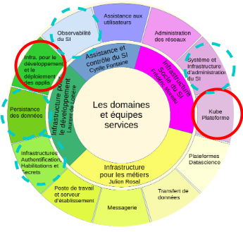
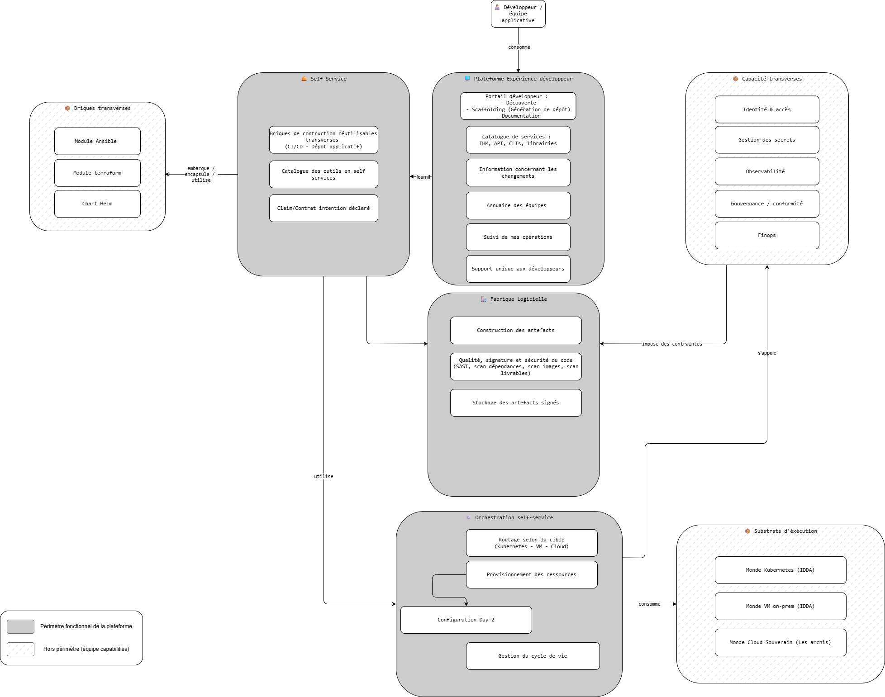
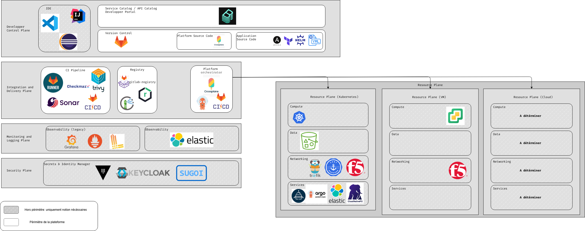
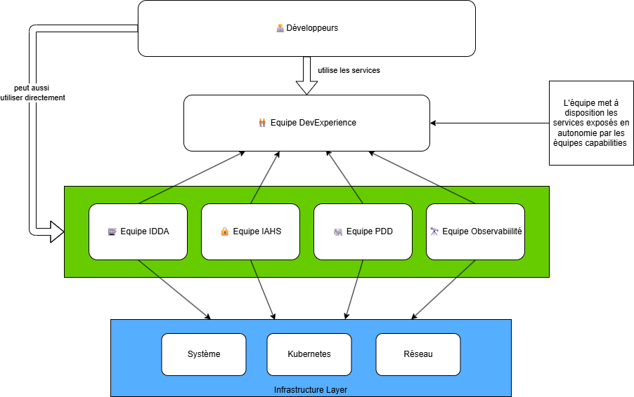
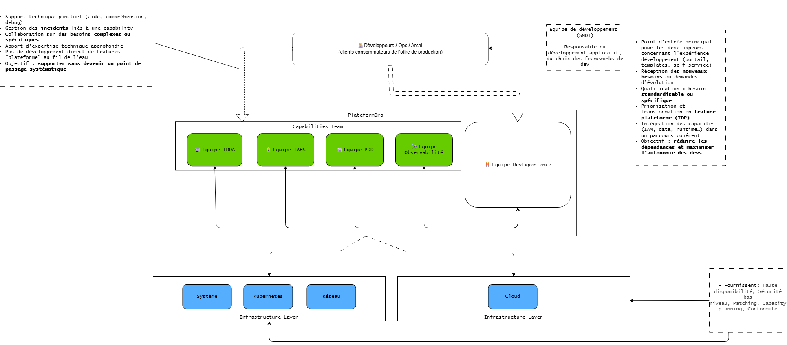
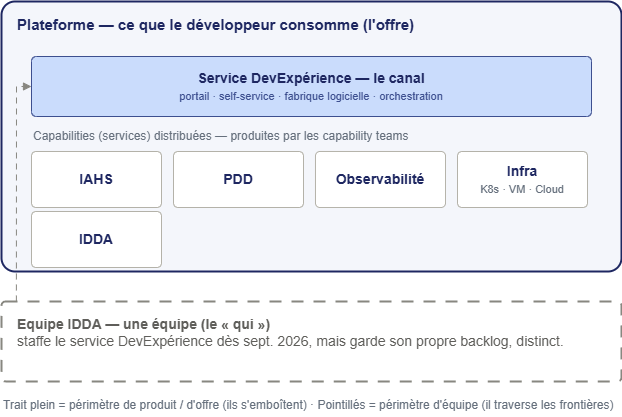

<!-- _class: title -->

# Vers une plateforme unifiée pour nos développeurs

## Quel périmètre ? Comment insérer l'équipe ? Quelle composition ?

---

# Vocabulaire : Les capabilities Team

Une capability team fournit du service sur son domaine de responsabilité sur lequel elle dispose d'un haut niveau d'expertise.

---

# Vocabulaire : Développeur

<strong>Le développeur</strong> conçoit, développe et maintient les applications du SI de l'Insee.  Un développeur ne se réduit pas à faire parti d'un SNDI, un ops qui développe une application est considéré comme un développeur.
C'est <strong>l'utilisateur (un des consommateurs) principal de la plateforme</strong> : il consomme les services exposés en self-service pour livrer de la valeur métier, sans avoir à maîtriser toute la complexité sous-jacente (les trois mondes d'exécution, les outils, les workflows).

 

À distinguer de la <strong>capability team</strong>, qui <em>produit</em> l'expertise infra ou de production ; le développeur, lui, la <em>consomme</em>.

---

# Le contexte en chiffres

<h3>250</h3>

développeurs au sein du SI Insee (hors équipes de production, également concernées)

<h3>2 (bientôt 3)</h3>

mondes d'exécution : VM, Kubernetes, (Cloud)

<h3>12</h3>

équipes services de la production

<h3>6 ans</h3>

d'adoption DevOps à uniformiser, standardiser, simplifier

<h3>10</h3>

Nombre de tickets (déclarés) minimun à créer pour une nouvelle plateforme

<h3>12</h3>

Moyenne du nombre de jours (déclarés) pour qu'une équipe mettent en place une nouvelle appli (code => déploiement) 

Une démarche Platform Engineering pour <strong>homogénéiser sans recentraliser</strong>

---

# Des irritants à résoudre

<h3>🔀 Hétérogénéité</h3>

Des connaissances hétérogènes entre individus / équipes / SNDI. Chaque équipe résout à sa manière les mêmes problèmes

<h3>🌍 Trois mondes, des dizaines d'outils, plusieurs workflows</h3>

Complexité portée par chaque équipe

<h3>🔍 Découvrabilité</h3>

Information dispersée, dépendance aux personnes

<strong>Conséquence :</strong> effort dupliqué · charge cognitive · variance des pratiques · onboarding lent

---

# Ce qu'on veut obtenir

Une logique simple, voulue par les devs (empruntée aux standards du _Platform Engineering_) :

| Aujourd'hui                      | Demain                                       |
| -------------------------------- | -------------------------------------------- |
| Le dev parle à **N équipes**     | Le dev parle à **1 seule équipe**            |
| Tickets et coordination manuelle | **Self-service** via une plateforme          |
| « À chacun son périmètre »       | **Une offre cohérente**, une roadmap commune |

L'objectif : **rendre les développeurs autonomes** et réduire leur charge.

<strong>Remarque :</strong> le but n'est pas d'interdire le dialogue entre les développeurs et les POs des équipes de services, mais de proposer un point d'entrée unique pour l'expérience developpeurs aux utilisateurs de la plateforme.

---
<!-- _class: section -->

# 1. Le périmètre

---

# Domaine fonctionnel du service DevExpérience

Ce que le service **doit faire** — indépendamment de qui la porte

---

# Sept blocs fonctionnels

<h3 class="scope-in">✅ Expérience développeur</h3>
Portail, catalogue, support

<h3 class="scope-in">✅ Self-Service</h3>
Templates, Claims

<h3 class="scope-in">✅ Fabrique logicielle</h3>
CI, qualité, sécurité

<h3 class="scope-in">✅ Orchestration self-service</h3>
Routage, provisioning, cycle de vie

<h3 class="scope-out">❌ Briques transverses</h3>
Helm · Terraform · Ansible

<h3 class="scope-out">❌ Capacités transverses</h3>
IAHS · PDD · Observabilité…

✅ Dans le périmètre plateforme &nbsp;·&nbsp; ❌ Hors périmètre, porté ailleurs

---

# Expérience développeur

Le visage de la plateforme — tout ce que le développeur voit

- 🎯 **Portail développeur** — découverte, scaffolding, documentation
- 📚 **Catalogue de services** — IHM, API, CLI, librairies
- 📢 **Information sur les changements** — communication produit
- 👥 **Annuaire des équipes** — qui possède quoi
- 📊 **Suivi des opérations** — restitution des actions
- 🆘 **Support unique** — un canal de contact identifié (cela n'empêche pas les devs de parler aux autres équipes)

Aucune autre équipe ne porte cette fonction dans le SI aujourd'hui.

---

# Self-Service

Transformer une intention en action industrialisée

- 👨🏻‍💻 **Golden path applicatif** — Dépôt de code pour les devs embarquant directement du code applicatif pur Insee, du cicd, les bonnes pratiques...
- 🧱 **Briques de construction réutilisables** — templates CI/CD, dashboard préconstruit, Exemple de dockerfile...
- 📋 **Catalogue des outils en self-service** — l'offre exposée au dev
- 📜 **Claim / Contrat d'intention** — Contrat permettant de déclarer _ce que je veux_, pas _comment le produire_

<strong>Cible : une offre agnostique</strong> — la migration cloud future devient un changement d'implémentation, pas une réécriture côté équipes. 
Agnostique <strong>ne veut pas dire neutre</strong> : le monde <strong>conteneurisé (Kubernetes/Cloud) reste privilégié</strong>, la cible par défaut.

---

# Fabrique logicielle

Du code à l'artefact prêt à déployer, avec contrôles intégrés

- 🏭 **Stockage du code applicatif / déploiement** — Forge logicielle
- 🔨 **Construction des artefacts** — pipelines CI mutualisés
- 🔐 **Qualité, signature, sécurité** — SAST, scan dépendances, scan images
- 📦 **Stockage des artefacts signés** — registre central

Intègre les <strong>gates qualité et sécurité transverses</strong> que tout artefact franchit avant la production.

---

# Orchestration self-service

Exécuter une Claim — router, provisionner, accompagner

- 🎯 **Routage selon la cible** — K8S, VM, Cloud
- ⚙️ **Provisionnement des ressources** — GitOps déclaratif
- 🔧 **Configuration Day-2** — agents, durcissement
- 🔄 **Gestion du cycle de vie** — création, évolution, suppression

<strong>Transverse aux trois mondes</strong> — aucune autre équipe ne couvre ce périmètre. Le <strong>conteneurisé (K8S/Cloud) est la cibles privilégiée</strong>,le monde VM restant pleinement supportés.

---

# Ce qui reste hors périmètre

| Bloc                                                      | Pourquoi hors plateforme                                              | Propriétaire                        |
| --------------------------------------------------------- | --------------------------------------------------------------------- | ----------------------------------- |
| 🧱 Briques transverses (Helm, TF, Ansible, Dépot de code) | Encodent l'expertise domaine                                          | Capability teams + Animation du dev |
| 🛡️ Capacités transverses (IAHS, PDD, Observabilité…)      | L'équipe s'appuie sur les briques proposées mais ne les maintient pas | Capability teams                    |
| 📦 Substrats d'exécution (K8s, VM, Cloud)                 | Opérés par l'infra                                                    | Équipes infrastructure              |

La plateforme est <strong>canal de distribution</strong> de l'expertise — pas son <strong>remplaçant</strong>.

---

# Technologie manipulée par l'équipe DevExperience

---

# Pourquoi ce découpage importe

<h3>📐 Dimensionnement</h3>

Équipe à taille humaine — pas d'experts à recruter dans tous les domaines

<h3>🤝 Alignement</h3>

Les capability teams gagnent un canal — pas une concurrente

<h3>📍 Clarté</h3>

Le développeur sait à qui s'adresser pour quoi

Sans ce découpage : goulot d'étranglement ou coquille vide.

---

<!-- _class: section -->

# 2. trois options d'insertion

Comment la Platform Experience se positionne-t-elle vis-à-vis des capability teams ?

---

# Trois positionnements

> Solution reposant sur une nouvelle équipe produit 100% autonome : une équipe DevExperience dédiée

 

<h3>A — Equipe Plateforme indépendante (autonome)</h3>

L'équipe DevExpérience <b>produit elle-même</b> la majorité des briques. Elle <b>réimplémente</b> tout pour ses utilisateurs

<h3>B — Equipe Plateforme produit + équipes capabilities (Consommatrice)</h3>

Les capability teams <b>exposent en autonomie</b> — L'équipe DevExpérience n'opère que le portail

<h3>C — Equipe Plateforme produit (Intégratrice) + équipes capabilities</h3>

L'équipe DevExpérience <b>assemble et distribue</b> ce que produisent les capability teams

---

# Option A — Plateforme indépendante (autonome)

 L'équipe DevExpérience internalise les expertises de domaine

<h3>✅ Avantages</h3>
<ul>
<li>Time-to-market rapide (et encore pas sûr)</li>
<li>Cohérence forte (un propriétaire)</li>
<li>Décisions techniques rapides</li>
<li>Interlocuteur unique</li>
</ul>

<h3>⚠️ Inconvénients</h3>
<ul>
<li>Risque de silo plateforme : <strong>un SI dans le SI</strong> — coût et maintenance en hausse</li>
<li>Effectif intenable à terme</li>
<li>Dette d'expertise inévitable</li>
<li>Concurrence avec capability teams</li>
</ul>

---

# Option B — Plateforme produit + équipes capabilities (Consommatrice)

L'équipe DevExpérience fournit le portail — les équipes capabilities intègrent en autonomie leur service dans le portail

<h3>✅ Avantages</h3>
<ul>
<li>Effectif PFE minimal</li>
<li>Autonomie capability teams maximale</li>
<li>Pas de goulot plateforme</li>
<li>Modèle "marketplace interne"</li>
</ul>

<h3>⚠️ Inconvénients</h3>
<ul>
<li>Cohérence d'expérience fragile</li>
<li>Industrialisation dispersée</li>
<li>PFE sans levier sur les standards</li>
<li>Maturité élevée requise chez chaque équipe capabilities</li>
<li>Pas de vision globale</li>
</ul>

C'est le modèle à la rundeck DevOps, mais avec une jolie interface.

---

---

# Option C — Plateforme produit (Intégratrice) + équipes capabilities

L'équipe DevExpérience <strong>assemble et distribue ce</strong> que produisent les capability teams. Elle devient le <strong>principal client</strong> des capability teams et bénéficie d'un <strong>fort sponsoring</strong> de la DSI

<h3>✅ Avantages</h3>
<ul>
<li>Effectif soutenable</li>
<li>Expertises capability teams valorisées</li>
<li>Cohérence sans concurrence</li>
<li>Évolutivité naturelle</li>
<li>Cohérence de l'offre hors plateforme</li>
<li>Amélioration de l'offre des capability teams</li>
</ul>

<h3>⚠️ Inconvénients</h3>
<ul>
<li>Coordination inter-équipes</li>
<li>Démarrage plus lent</li>
<li>Maturité minimale requise</li>
<li>Responsabilité distribuée</li>
<li>Les bonnes pratiques poussées par l'équipe DevExperience peuvent ne pas être intégrées dans les équipes capabilities</li>
<li>Nécessite fort sponsoring de la DSI</li>
</ul>

---

---

# Comparaison synthétique

| Critère                       | A — Autonome | B — Consommatrice | C — Intégratrice |
| ----------------------------- | ------------ | ----------------- | ---------------- |
| Effectif PFE                  | 🔴 Élevé     | 🟢 Faible         | 🟡 Modéré        |
| Time-to-market initial        | 🟢 Rapide    | 🟡 Modéré         | 🟡 Modéré        |
| Pérennité 3-5 ans             | 🔴 Faible    | 🟢 Élevée         | 🟡 Modérée       |
| Cohérence d'expérience        | 🟢 Forte     | 🔴 Variable       | 🟢 Forte         |
| Valorisation capability teams | 🔴 Faible    | 🟢 Élevée         | 🟢 Élevée        |

---

| Critère                                 | A — Autonome | B — Consommatrice | C — Intégratrice               |
| --------------------------------------- | ------------ | ----------------- | ------------------------------ |
| Risque politique                        | 🔴 Élevé     | 🟡 Modéré         | 🟡 Modéré                      |
| Maturité requise du SI                  | 🟢 Faible    | 🔴 Élevée         | 🟡 Modérée                     |
| Cohérence hors plateforme               | ⚫ N/A       | 🔴 Faible         | 🟢 Élevée (si fort sponsoring) |
| Montée en maturité des capability teams | 🔴 Aucune    | 🟡 Indirecte      | 🟢 Forte (si fort sponsoring)  |

---

# Couverture fonctionnelle par option

<h3>A — Autonome</h3>

Tout, mais rien de fiable

4 domaines réimplémentés · doublons fragiles

<h3>B — Consommatrice</h3>

Ce que les équipes veulent bien exposer

Couverture partielle · conditionnelle à leur maturité

<h3>C — Intégratrice</h3>

Une offre cohérente, assemblée

4 capacités intégrées · soutenable

La couverture <strong>disqualifie A, B</strong> — reste <strong>C</strong>. 
Le vrai choix : <strong>quelle promesse l'Insee peut tenir</strong> vis-à-vis de ses 250 développeurs — et, au-delà, de ses équipes de production.

---

# Trois questions pour arbitrer

<h3>1. Maturité capability teams ?</h3>

Moyen/Faible → A, C Élevée → B

<h3>2. Effectif PFE à 2 ans ?</h3>

&lt; 5 → B 5-10 → C &gt; 10 → A possible

<h3>3. Culture de coopération ?</h3>

Faible → A  Forte → B, C

Les fourchettes d'effectif sont des <strong>ordres de grandeur indicatifs</strong>, à confirmer selon le périmètre réellement staffé.

---

# Recommandation

L'**Option C** comme cible de référence moyen long terme

---

# Pourquoi l'option C

<h3>🏗️ Continuité culturelle</h3>

Prolonge 6 ans de DevOps : industrialiser, pas tout recentraliser

<h3>♻️ Soutenable</h3>

Effectif à taille humaine, expertises Insee valorisées

<h3>📖 Éprouvé</h3>

Team Topologies + référence CNCF + ce qui est fait ailleurs

---

# Décision (post-réunion)

L'option C est validée ✅

---

<!-- _class: section -->

# Insertion dans notre organisation

---

## Responsabilités Développeurs

- Développement du portail (Backstage), des templates, de la CLI
- UX développeur et intégration front
- Maintien du catalogue de composants et de la documentation TechDocs

---

## Responsabilités Ops

- Intégration avec les outils existants (Kubernetes, ArgoCD, Vault, GitLab CI, Nexus)
- MCO/MCS des briques constituant l'offre
- Automatisation des workflows d'infrastructure
- Liaison technique avec les capability teams

---

## Responsabilités DevOps

- Conception et maintenance des Golden Paths
- Pipelines CI/CD standardisés
- GitOps et déploiement continu
- Pont entre les besoins dev et les contraintes ops

---

# Composition théorique

La littérature conseille généralement **une équipe** de **6 personnes** avec trois profils complémentaires :

- 2 Développeurs (Développement du portail, apport de la vision dev)
- 2 Opérationnels (MCO/MCS des briques appartenant à la plateforme)
- 2 DevOps (Automatisation, orchestration des différents éléments)

---

# Quelle intégration dans la roue de la prod ?

La cible reste une équipe / un service dédié (option A)

- 🎯 **1 nouveau service** avec sa **roadmap** et son **PO** dédiés, et des **ressources** propres pour réaliser le service

<strong>Mais difficile à mettre en place dès septembre 2026 :</strong>
<ul>
<li>l'identification du PO, la construction de la roadmap et l'identification des ressources <strong>prennent du temps</strong></li>
<li>en septembre, on ajoute d'abord la roadmap <strong>KubeApp</strong> dans la roadmap IDDA</li>
</ul>

---

# En septembre 2026

Un démarrage pragmatique, porté par IDDA

- 🆕 **Création d'un nouveau service** dans la roue de la prod
- 🗺️ **Création d'une roadmap DevExpérience** par le CPO et les deux POs d'IDDA
- 🤝 **Travail collaboratif des deux POs** pour organiser les priorités de l'équipe IDDA
- ⚙️ **Réalisation des priorités** au sein de l'équipe IDDA

L'organisation des équipes <strong>sur le long terme</strong> sera instruite dans un second temps, par la <strong>hiérarchie</strong>, en collaboration avec les agents.

---

# Décision (post-réunion)

Cible : un service DevExpérience dédié — démarrage porté par IDDA dès septembre 2026

- ✅ **Cible** : un nouveau service dédié, avec PO et roadmap propres
- ⏳ **Démarrage sept. 2026** : porté par IDDA et les 2 POs, le temps de construire la roadmap de monter en compétences et de staffer l'équipe
- 🧭 **Organisation cible** instruite dans un second temps par la hiérarchie, en collaboration avec les agents

Il est demandé à IDDA et aux POs de bien mettre en avant <strong>dans les communications</strong> aux utilisateurs que le périmètre / backlog du produit DevExpérience est <strong>bien distinct</strong> de celui d'IDDA.

---

<!-- _class: section -->

# Merci à vous !

Des questions ?

---

# Trois périmètres, trois natures
 

La confusion vient d'une comparaison de choses <strong>qui ne sont pas de même nature</strong>

| Objet | Nature | Question | En une phrase |
| --- | --- | --- | --- |
| **IDDA** | une **équipe** (org) | **QUI ?** | Une équipe existante qui héberge temporairement les ressources DevExpérience — tout en gardant son propre produit (service IDDA) / backlog |
| **Service DevExpérience** | un **produit** (responsabilité) | **QUOI ?** | La couche expérience + intégration : portail, self-service, fabrique, orchestration. Le *canal*. N'inclut **pas** l'expertise de domaine |
| **Plateforme** | une **offre** (vue du dev) | **RÉSULTAT ?** | Tout ce que le développeur consomme : la couche DevExpérience **+** toutes les capabilities distribuées |
 

IDDA = une <strong>équipe</strong> · DevExpérience = un <strong>produit</strong> · Plateforme = ce que le dev <strong>obtient au bout</strong>.

---
 
# Comment ils s'emboîtent

---
 
# Les deux pièges à éviter
 

<h3>⚠️ Piège 1 — IDDA ≠ DevExpérience</h3>

Mêmes personnes en septembre 2026, mais <strong>deux backlogs distincts</strong>. Appartenir à IDDA (l'équipe) ne dit rien du périmètre du produit qu'on porte.

<h3>⚠️ Piège 2 — DevExpérience ≠ Plateforme</h3>

DevExpérience <strong>assemble et distribue</strong> ; la plateforme est plus large : elle inclut tout ce que les capability teams exposent à travers elle. On <strong>distribue</strong> l'expertise, on ne la <strong>possède</strong> pas.

🛒 <strong>L'image :</strong> la plateforme, c'est le magasin tel que le client le vit ; DevExpérience range les rayons et tient la caisse ; les capability teams fabriquent les produits ; IDDA est un fournisseur qui prête aussi son personnel au démarrage.

---
 
# Le réflexe qui tranche
 

Face à « périmètre X », se demander de quelle <strong>nature</strong> on parle

<h3>« Qui fait ? »</h3>

→ <strong>IDDA</strong> (l'équipe)

<h3>« Quel produit / backlog ? »</h3>

→ <strong>DevExpérience</strong> (le produit)

<h3>« Qu'obtient le dev ? »</h3>

→ <strong>la Plateforme</strong> (l'offre)

Les deux phrases à marteler : « <strong>Être membre d'IDDA ≠ travailler sur le périmètre DevExpérience</strong> » &nbsp;·&nbsp; « <strong>DevExpérience distribue les capabilities, elle ne les possède pas</strong> ».

