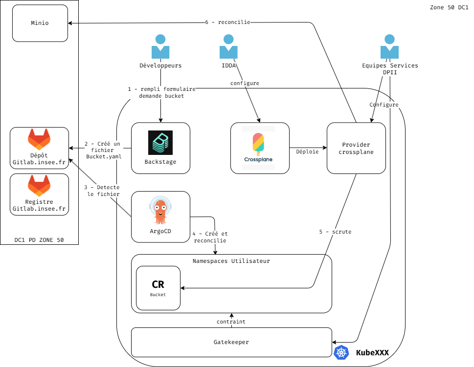

<!-- _class: title -->

# Crossplane

## Le control plane universel pour industrialiser l'infrastructure

Une opportunité pour notre plateforme interne (Platform Engineering)

---

<!-- _class: section -->

# Le constat

Pourquoi le Platform Engineering, et pourquoi un portail ne suffit pas

---

# Pourquoi on fait du Platform Engineering ?

<h3>🔀 Livraisons lentes</h3>

Des délais dûs aux tickets et aux allers-retours manuels

<h3>🧩 Hétérogénéité</h3>

<b>Ops</b> : outils et scripts fragmentés propres à chaque équipe.

<b>Devs</b> : complexité d'apprentissage

<h3>🌍 Trois mondes, des dizaines d'outils</h3>

Plusieurs workflows, complexité portée par chaque équipe

<h3>🔍 Découvrabilité</h3>

Information dispersée, dépendance aux personnes

<strong>Conséquence :</strong> effort dupliqué · charge cognitive · variance des pratiques · onboarding lent

---

# Un portail développeur ne suffit pas

La première réponse envisagée est un **portail** (Backstage chez nous). Utile, mais partiel :

<h3>✅ Ce qu'il apporte — day 0</h3>

Il <b>expose</b> un catalogue et <b>génère</b> des dépôts.

<h3>⛔ Ce qui manque — day 2</h3>

Il <b>ne gère pas</b> le cycle de vie : évolutions, mises à jour, conformité dans la durée.

C'est une <strong>vitrine</strong> ; il manque le <strong>moteur</strong> qui provisionne et gouverne réellement. → Il faut un <strong>moteur d'orchestration</strong> sous le portail (un <em>control plane</em>).

---

# Un moteur d'orchestration, à quoi ça sert ?

Il ne se contente pas d'exécuter une action une fois : il maintient un système dans l'état voulu, en continu.

<h3>🎯 État désiré déclaratif</h3>

Côté dev, on décrit le <b>résultat</b> attendu, pas la suite d'étapes pour l'obtenir.

<h3>🔄 Boucle de réconciliation</h3>

En arrière-plan, il compare en permanence l'état réel à l'état voulu et agit pour combler l'écart.

<h3>🔧 Auto-réparation</h3>

En cas de panne ou de modification hors cadre, il corrige de lui-même.

→ L'implémentation la plus courante dans les démarches de platform engineering est l'outil <strong>Crossplane</strong>.

---

# Articulation avec Backstage

Backstage et Crossplane ne se concurrencent pas : deux couches complémentaires.

<h3>🖥️ Backstage = la vitrine</h3>

Portail développeur : catalogue de services, documentation, responsabilités, formulaires self-service (<em>Software Templates</em>). Aucun moteur pour provisionner réellement — il pousse des fichiers dans des dépôts.

<h3>⚙️ Crossplane = le moteur</h3>

Control plane : reçoit la demande, provisionne, maintient conforme. Pas de portail (UI) par lui-même.

---

# Backstage : générer n'est pas gérer

<h3>Day 0 — l'amorçage</h3>
<ul>
<li>Les <em>Software Templates</em> <b>génèrent un dépôt</b> à partir d'un modèle (fichiers, structure, création du repo).</li>
<li>Excellent pour démarrer vite et de façon standardisée.</li>
</ul>

<h3>Day 2 — le cycle de vie</h3>
<ul>
<li>Une action <b>ponctuelle</b> : une fois le dépôt créé, le lien avec le template est rompu.</li>
<li>Il suit des <b>métadonnées</b>, mais ne pilote pas l'<b>état réel</b> des ressources.</li>
<li>Lors d'une évolution, les dépôts déjà générés <b>ne bougent pas</b> : migration à la main, dépôt par dépôt.</li>
</ul>

---

# Orchestrer plutôt qu'exécuter : pourquoi pas Terraform ?

<h3>Script / pipeline — impératif & ponctuel</h3>
<ul>
<li>Enchaîne des étapes, puis s'arrête.</li>
<li>Si l'état dérive ensuite, <b>personne ne le sait</b>.</li>
<li>Ex. Terraform / OpenTofu, Ansible, Puppet.</li>
</ul>

<h3>Moteur d'orchestration — déclaratif & permanent</h3>
<ul>
<li>Porte la responsabilité <b>continue</b> de l'état.</li>
<li>On raisonne en <b>résultat voulu</b>, pas en procédures.</li>
<li>Dérive et pannes gérées automatiquement ; on fait évoluer le « voulu » et le système <b>converge</b>.</li>
</ul>

→ C'est le principe qui a fait le succès de <strong>Kubernetes</strong> pour les applications. <strong>Crossplane l'étend à toute l'infrastructure.</strong>

---

<!-- _class: section -->

# Crossplane

L'outil, son fonctionnement et le contrat d'interface

---

# L'outil Crossplane

<h3>📖 Un standard ouvert</h3>

<b>Open source</b> (licence Apache 2.0), créé par Upbound, à <b>gouvernance neutre</b> — pas de dépendance à un éditeur.

<b>Projet CNCF « gradué »</b> (28 octobre 2025) : plus haut niveau de maturité, aux côtés de Kubernetes, Prometheus et Helm. Gage de pérennité et de sécurité.

<h3>🧱 Comment il s'installe</h3>

Idéalement, il s'installe dans un cluster Kubernetes <b>dédié</b>, qui joue le rôle de <em>control plane</em> : il <b>pilote</b> l'infrastructure, il <b>n'héberge pas</b> les applications.

De base, Crossplane est une brique vide : il fonctionne avec des <b>Providers</b>.

<strong>Prérequis principal :</strong> disposer d'un cluster Kubernetes → les compétences K8s sont le socle nécessaire.

---

# Comment ça marche, en simplifié

Une boucle de réconciliation permanente (héritée de Kubernetes) : on décrit l'état voulu, le système corrige en continu les écarts avec le réel.

<h3>1 · La brique de base</h3>

Chaque ressource (Bucket / client Keycloak / VM…) a une représentation dans Kubernetes, fournie par un <em>provider</em>.

<h3>2 · L'abstraction</h3>

L'équipe DevExperience (ou une équipe service) assemble des briques en un service de plus haut niveau et en définit l'interface (la <em>Composition</em> = la recette qui traduit en ressources concrètes).

<h3>3 · La demande</h3>

Le dev réclame le service via cette interface (la <em>Claim</em>) ; Crossplane compose, appelle les API, puis surveille et répare.

---

# La notion de contrat d'interface

L'équipe DevExperience (ou les équipes services) n'expose pas une implémentation, mais un **contrat** : une interface stable de ce que le dev peut demander.

- Dans Crossplane, ce contrat est une **API** (appelée XRD) que le dev consomme via une simple demande (YAML poussé dans un dépôt Git).
- Le dev dépend du **contrat**, jamais de ce qu'il y a derrière.
- L'implémentation (la *Composition*) peut changer librement : changer de provider, ajouter du chiffrement, durcir une règle, corriger une faille — **sans casser le contrat**.

C'est ce découplage <strong>interface / implémentation</strong> qui rend l'évolution possible à grande échelle, sans impact pour le dev.

---

# L'évolution, gérée en continu

Quand l'équipe DevExperience (ou les équipes services) fait évoluer l'implémentation derrière le contrat :

- **toutes les instances existantes** se réconcilient vers le nouvel état désiré.
- **aucune action** requise de chaque dev, **aucune migration** dépôt par dépôt.
- la nouvelle règle ou le correctif s'applique partout, automatiquement.

<strong>La différence clé :</strong> Backstage <strong>génère une fois</strong> ; Crossplane <strong>gouverne en continu</strong>, derrière un contrat stable.

---

# Articulation avec Backstage : le flux

<h3>Le schéma d'assemblage typique</h3>

1. Le dev remplit un formulaire dans <b>Backstage</b>

2. → génération d'une demande Crossplane (un manifeste)

3. → déposée dans <b>Git</b>

4. → appliquée par <b>GitOps</b> (Argo CD)

5. → <b>Crossplane</b> provisionne et gouverne

6. → Backstage réaffiche l'état des ressources

<h3>En une phrase</h3>

<b>Backstage</b> répond au « comment le dev demande et suit sa ressource ».

<b>Crossplane</b> répond au « comment elle est réellement livrée et gouvernée ».

---

# Exemple avec un bucket

---

# À l'Insee : chacun sa brique, la plateforme assemble

- Chaque **équipe service** publie **sa** partie comme une brique réutilisable (ex. base de données, client Keycloak, Bucket), et en reste **responsable**.
- La **plateforme assemble** ces briques en services de plus haut niveau (composition de compositions).
- On répartit ainsi la charge : pas besoin de tout concentrer sur une seule équipe.

<strong>Consommation directe possible :</strong> comme chaque brique est une API, un dev peut la consommer <strong>directement</strong> (Git / kubectl), <strong>sans passer par la plateforme</strong> ni par un intermédiaire. Le portail (Backstage) reste une commodité, pas un péage obligatoire.

---

<!-- _class: section -->

# Les arguments & les bénéfices

Ce que Crossplane change, concrètement

---

# Les arguments pour Crossplane
## Réduction des tickets

- L'équipe DevExperience (ou une équipe service de la prod) publie **une fois** une brique réutilisable ; les équipes se servent seules.
- Une demande n'est plus un ticket traité à la main, mais une déclaration prise en charge automatiquement.
- Le goulot d'étranglement humain disparaît.

---

# Les arguments pour Crossplane
## Une consommation « as a service »

- L'infrastructure devient un **catalogue de services internes**.
- Le dev « commande » une ressource comme un service managé cloud, mais avec **garde-fous intégrés** (grâce aux outils Kubernetes).

---

# Les arguments pour Crossplane
## La richesse des providers

- Couverture des trois grands clouds, mais aussi Kubernetes, Helm, bases SQL, GitHub, Cloudflare, divers SaaS…
- Les providers officiels sont générés depuis les API cloud et couvrent des **milliers de ressources**.
- On ne pilote pas que « du cloud » : presque tout l'écosystème technique, avec le même modèle.

---

# Les arguments pour Crossplane
## Une interface pensée pour les devs

- Le développeur manipule une **abstraction simple**.
- Il reste dans ses outils habituels (YAML dans un dépôt Git, ou le portail Backstage).
- L'équipe DevExperience garde la main sur ce qu'il y a derrière.

---

# Les arguments pour Crossplane
## Uniformiser la manière d'exposer ses services

- L'ensemble des équipes de la prod diffuse ses services **sous la même forme**.
- Trois modes de consommation cohabitent :

<h3>Équipes services</h3>

gèrent et publient leurs briques.

<h3>DevExperience</h3>

propose un assemblage prêt à l'emploi aux développeurs.

<h3>Développeurs</h3>

consomment l'assemblage… ou une brique directement.

---

# Les arguments pour Crossplane
## Politiques d'enforcement directement dans Kubernetes

- Tout passe par l'API Kubernetes → on récupère son écosystème de gouvernance (RBAC, Kyverno, OPA/Gatekeeper).
- On impose des règles **à la création** de la ressource :
  - « en prod, toute base doit être chiffrée »
  - « pas de policy contenant public »
  - « calcul de quotas »

La conformité devient <strong>systématique</strong>, plus une vérification manuelle après coup.

---

# Résumé — les bénéfices côté développeur

<h3>🚀 Self-service</h3>

Il obtient sa ressource sans ticket ni attente.

<h3>🧭 Simplicité</h3>

Une abstraction claire, sans connaître AWS/Azure/GCP ni l'outillage infra sous-jacent.

<h3>🛠️ Outils familiers</h3>

Il reste dans Git / kubectl, son workflow habituel.

<h3>🔓 Autonomie & garde-fous</h3>

Il consomme l'API avec ou sans portail ; sécurité et conformité sont gérées pour lui.

---

# Résumé — les bénéfices côté ops / plateforme

<h3>🛡️ Gouvernance centralisée</h3>

Politiques appliquées à la création (Kyverno / OPA), RBAC.

<h3>📐 Standardisation</h3>

Un seul modèle, un seul workflow GitOps pour toutes les infras.

<h3>🔁 Évolution maîtrisée</h3>

On change l'implémentation derrière le contrat → ça se propage tout seul.

<h3>👁️ Contrôle continu</h3>

Moins de tickets répétitifs ; l'état réel est réconcilié en permanence, la dérive corrigée.

