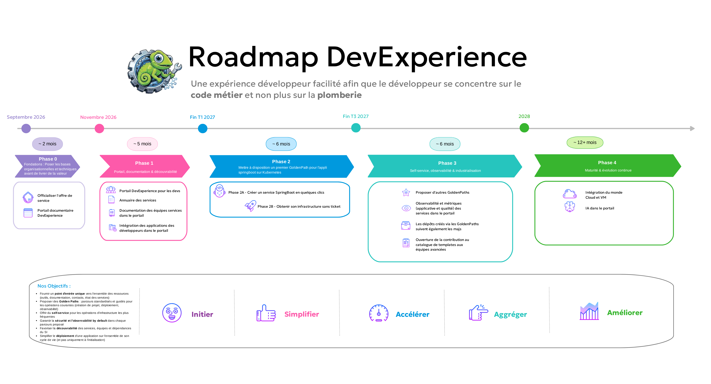

<!-- _class: title -->

# Feuille de route Platform Engineering

## Un phasage progressif, du quick win à la maturité continue

Point de suivi — Equipe DevExperience

---

# Où on en est

<h3>✅ Diagnostic</h3>
9 irritants majeurs, 3 personas, 18 cas d'utilisation identifiés sur le terrain

<h3>✅ Offre & organisation</h3>
Option C validée, démarrage porté par IDDA dès septembre 2026

<h3>✅ POC</h3>
Backstage et Crossplane expérimentés et retenus

Reste à valider aujourd'hui : <strong>dans quel ordre on livre</strong>

---

# Ce que cette feuille de route ne fait pas

Elle ne revient pas sur le <strong>cadrage organisationnel</strong> (ADR-003, déjà validé) : équipe, positionnement vis-à-vis des capability teams, démarrage IDDA. Elle ne porte que sur le <strong>phasage</strong> — quoi livrer, dans quel ordre, avec quels critères de sortie.

**Principe directeur** : approche **itérative**, pas Big Bang. Chaque phase livre de la valeur mesurable avant d'attaquer la suivante.

---

<!-- _class: section -->

# Vue d'ensemble

Cinq phases, du quick win à l'amélioration continue

---

---

# Les phases en un coup d'œil

<h3>0</h3>
Fondations

Équipe, backlog, état des lieux

<h3>1</h3>
Portail & doc

Quick win, tous les devs

<h3>2</h3>
Golden Path Kube

MVP de bout en bout

<h3>3</h3>
Self-service

Industrialisation

<h3>4</h3>
Maturité

Amélioration continue

---

<!-- _class: section -->

# Phase 0 — Fondations

Mois 1-2 (sept.–oct. 2026)

---

# Phase 0 — Objectif

Poser les bases organisationnelles et techniques avant de livrer de la valeur

<h3>Organisationnel</h3>

Une équipe DevExperience montée en compétence, un backlog défini, des équipes pilotes engagées et un canal de retour utilisateur en place

<h3>Technique</h3>

Une vision claire de la documentation existante à intégrer, un premier Backstage accessible pour commencer à construire dessus

---

# Phase 0 — Découpage en US techniques

| Priorité    | User story                                                                              |
| ----------- | --------------------------------------------------------------------------------------- |
| **Forte**   | Installer Backstage (vanilla) en environnement de dev                                   |
| **Forte**   | Cartographier la documentation existante nécessaire aux développeurs, équipe par équipe |
| **Forte**   | Définir le backlog initial de l'équipe DevExperience                                    |
| **Moyenne** | Identifier et engager 2-3 équipes pilotes volontaires                                   |
| **Moyenne** | Mettre en place un forum utilisateur (retours développeurs)                             |
| **Moyenne** | Identifier les besoins de formations / accompagnement                                   |

---

# Phase 0 — Critères de sortie

- Équipe constituée et opérationnelle
- Backstage accessible en environnement de dev
- Équipes pilotes identifiées et engagées
- Cartographie de la documentation existante réalisée
- Le contact avec les prestataires a été réalisé

---

<!-- _class: section -->

# Phase 1 — Portail, doc & découvrabilité

Mois 2-5 : Quick win — tous les devs, tous les SNDI

---

# Phase 1 — Objectif

Résoudre l'irritant n°1 du constat terrain : documentation dispersée et syndrome « Martine »

- **Trouver le bon service et son propriétaire en un clic** : catalogue centralisé de tous les composants
- **Ne plus chercher la doc au bon endroit** : documentation des capability teams centralisée et à jour
- **Savoir qui contacter, sans deviner** : annuaire des équipes et interlocuteurs
- **Voir ce qui a changé ou va changer** : feed des changements et incidents
- **Trouver l'info en cherchant, pas en naviguant** : moteur de recherche intégré

**BONUS** : un parcours d'onboarding pour prendre en main l'outil

---

# Phase 1 — Découpage en US techniques

| Priorité    | User story                                                                |
| ----------- | ------------------------------------------------------------------------- |
| **Forte**   | Déployer Backstage en production                                          |
| **Forte**   | Déployer le Software Catalog Backstage (composants, owners, dépendances)  |
| **Forte**   | Migrer la documentation des capability teams vers TechDocs (docs-as-code) |
| **Forte**   | Développer l'annuaire des équipes et interlocuteurs                       |
| **Forte**   | Documenter l'utilisation pour les différents utilisateurs                 |
| **Moyenne** | Documenter les choix d'architecture et d'implémentation (Homologation)    |
| **Moyenne** | Mettre en place le feed des changements et incidents                      |

---

| Priorité    | User story                                                                                    |
| ----------- | --------------------------------------------------------------------------------------------- |
| **Moyenne** | Identifier un moteur de recherche pour le portail (solution interne backstage / externe / IA) |
| **Moyenne** | Déployer le moteur de recherche pour le portail                                               |
| **Moyenne** | Collaborer avec l'urbanisation afin d'identifier le rôle de backstage par rapport à Oscar     |
| **Moyenne** | Initier l'intégration des briques des développeurs dans le catalogue     |
| **Bonus**   | Construire le parcours d'onboarding                                                           |

---

# Phase 1 — Critères de sortie

- Portail accessible à tous les devs, tous SNDI
- Documentation d'au moins **80%** des capability teams intégrée dans TechDocs
- Au moins **50%** des services/outils (de la prod) référencés dans le catalogue
- Trafic portail en croissance mois sur mois
- Réduction mesurable des questions « à qui je m'adresse ? » sur Tchap
- Demo de la solution en DevOpsAcc + des démos d'avancements régulières
- Un dossier d'archi est initialisé et complété
- Les équipes pilotes ont intégré une grande part de leur service dans le catalogue

---

<!-- _class: section -->

# Phase 2 — Mettre à disposition un premier GoldenPath pour l'appli springboot sur Kubernetes

Mois 4-7 · Chevauche la fin de la Phase 1

---

# Phase 2 — Objectif

Livrer un premier parcours standardisé de bout en bout pour les applications Spring Boot sur Kubernetes

- **Créer un service Spring Boot en quelques clics** : repo, pipeline et déploiement générés automatiquement, sans partir d'une page blanche
- **Obtenir son infrastructure sans ticket** : client Keycloak, policy Vault, bucket... disponibles en self-service, brique par brique
- **Trouver et comprendre le Golden Path sans aide extérieure** : parcours et documentation découvrables directement depuis le portail

---

# Phase 2 — Découpage en US techniques

## Créer un service en quelques clics

| Priorité    | User story                                                                       |
| ----------- | -------------------------------------------------------------------------------- |
| **Forte**   | Scaffolder un service Spring Boot (repo + pipeline CI/CD) depuis Backstage       |
| **Forte**   | Déployer automatiquement le service généré sur l'environnement Kube (GitOps)     |
| **Forte**   | Demander un client Keycloak via une Claim Crossplane                             |
| **Forte**   | Demander une policy Vault via une Claim Crossplane                               |
| **Forte**   | Demander un bucket via une Claim Crossplane                                      |
| **Moyenne** | Documenter le Golden Path dans TechDocs, référencé dans le catalogue             |
| **Moyenne** | Standardiser le pipeline avec des Components CI (To Be Continuous)               |
| **Moyenne** | Documenter comment intégrer le GoldenPath si j'ai déjà une application existante |

---
## Obtenir son infrastructure sans ticket

---

# Phase 2 — Critères de sortie

- Au moins **3 projets créés** via le Golden Path par les équipes pilotes
- Feedback collecté et intégré dans le backlog
- Temps de création d'un nouveau projet **< 15 minutes** (vs jours actuellement)

---

<!-- _class: section -->

# Phase 3 — Self-service, observabilité & industrialisation

Mois 6-10

---

# Phase 3 — Objectif

Étendre le self-service, intégrer l'observabilité, généraliser au-delà des équipes pilotes

<h3>Self-service</h3>
Provisionner un environnement sans ticket, être protégé par défaut, ne plus être seul face à un incident

<h3>Observabilité</h3>
Voir la santé de son service en un coup d'œil, être alerté seulement quand c'est pertinent

- **Proposer d'autres GoldenPaths** : Capitaliser sur les outils mis en place pour le premier golden path pour en proposer d'autres (React / Python)
- **Profiter des évolutions du Golden Path sans tout refaire** : mise à jour des templates propagée automatiquement
- **Consommer les capability teams sans changer d'outil** : intégration étendue (PDD, IAHS, Observabilité)
- **Contribuer, pas seulement consommer** : catalogue ouvert aux équipes avancées

---

# Phase 3 — Découpage en US techniques

| Priorité    | User story                                                                                                     |
| ----------- | -------------------------------------------------------------------------------------------------------------- |
| **Forte**   | Provisionner un environnement via UI (ou as code), sans ticket                                                 |
| **Forte**   | Etudier les mécanismes de sécurité à intégrer dans le pipeline                                                 |
| **Forte**   | Construire le dashboard de santé des services (plugins ArgoCD et Elastic, intégration aux outils analyzer ...) |
| **Moyenne** | Générer des alertes pertinentes et filtrées                                                                    |
| **Moyenne** | Intégrer des runbooks et une aide au diagnostic dans le portail                                                |
| **Moyenne** | Propager les mises à jour de template aux projets existants (`copier update`)                                  |
| **Moyenne** | Étendre l'intégration aux capability teams PDD, IAHS, Observabilité                                            |
| **Faible**  | Ouvrir la contribution au catalogue de templates                                                               |

---

# Phase 3 — Critères de sortie

- Adoption mesurable **au-delà** des équipes pilotes
- Réduction mesurable du nombre de tickets d'infrastructure
- Satisfaction développeur en hausse (enquête DevExp)

---

<!-- _class: section -->

# Phase 4 — Maturité & évolution continue

Mois 10+ · Sans fin définie

---

# Phase 4 — Axes d'évolution

- **Extension au monde Cloud et VM** (selon résultats du questionnaire cloud prévu juin 2026)
- **Automatisation avancée** : Assembler l'ensemble des claims as a service en une macro claim (Par Exemple SpringBootApp)
- **Intégration IA** : aide au diagnostic, suggestion de résolution
- **Métriques DORA** : fréquence de déploiement, lead time, MTTR, taux d'échec
- **Contribution communautaire active** (inner source)

La plateforme est un <strong>produit</strong>, pas un projet : cette phase n'a pas vocation à se terminer.

---

<!-- _class: section -->

# Piloter la trajectoire

---

# Comment on mesure qu'on avance

<h3>📈 Adoption</h3>
Visites portail, services catalogués, projets créés via Golden Path

<h3>🎯 Impact</h3>
Temps de création de projet, temps d'onboarding, tickets d'infra, questions « à qui m'adresser »

<h3>😊 Satisfaction</h3>
Score DevExp, feedback qualitatif des pilotes, NPS interne

Le détail des indicateurs et de la gouvernance produit est posé dans l'ADR-012.

---

<!-- _class: section -->

# Merci à vous !

Des questions ?
