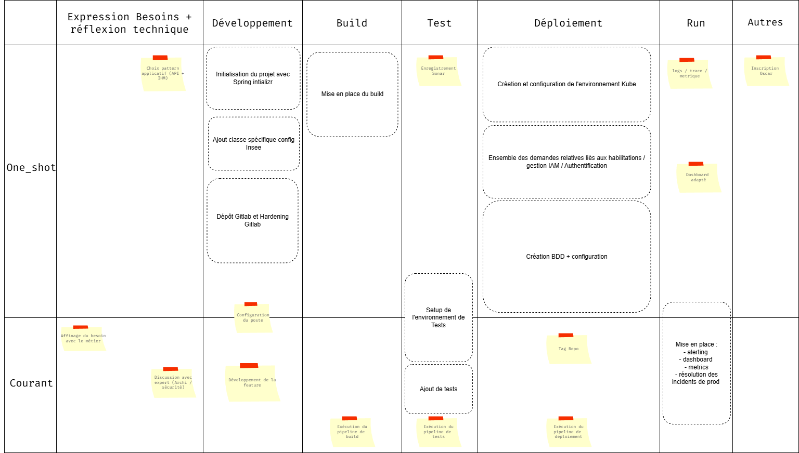

# 🎮 Platform Engineering Game

Faire vivre aux équipes :

- le chaos actuel
- l’impact d’une plateforme

Et faire émerger les besoins réels de la plateforme.

**Principe**: Chaque équipe est une team Produit qui doit livrer une feature rapidement

**Objectif**: Livrer la feature le plus rapidement possible

**Score**: Temps de livraison

## Round 1 - Le monde sans plateforme

**Règle du jeu** : Les équipes doivent passer par chacune des étapes ci dessous. Elles doivent écrire sur post-it pour chacune des étapes ce qu'elles font en général à cette étape.

**Contexte**: Le DSI souhaite mettre en place une nouvelle application. Il a des exigence fortes en terme de disponibilité et de fonctionnalités. 

**Board** : Board constitué à partir des retours des devs sur les actions "habituelle" réalisées. Réalisons une estimations coût/complexité sur les cartes entourées. Regardons le temps nécéssaire pour réaliser l'ensemble des actions dans le cas où tout va bien.

Introduisons maintenant un peu de chaos 

### Obstacles
#### 🧱 DEV / SETUP

---

🟥 Poste mal configuré

**Contexte :** configuration locale incomplète  

**Effet :**

- ⏱ +10 min
- 🔁 Retour `Dev`

---

🟥 Initializer incomplet

**Contexte :** Spring Initializr mal configuré  

**Effet :**

- 🔁 Rejouer bloc setup projet

---

🟥 Repo mal initialisé

**Contexte :** repo sans règles, README, conventions  

**Effet :**

- ⏱ +10 min

---

🟥 Sécurité mal configurée

**Contexte :** Spring Security / Swagger incorrect  

**Effet :**

- 🔁 Retour `Dev`

---

#### ⚙️ BUILD

---

🟥 GitLab CI KO

**Contexte :** pipeline ne démarre pas  

**Effet :**

- 🔁 Retour `Build`

---

🟥 Dockerfile invalide

**Contexte :** image ne build pas  

**Effet :**

- 🔁 Rejouer `Build`

---

🟥 Renovate casse le build

**Contexte :** dépendance incompatible  

**Effet :**

- 🔁 Retour `Build` + `Test`

---

#### 🧪 TEST

---

🟥 Tests instables

**Contexte :** flaky tests  

**Effet :**

- 🔁 Rejouer `Test`

---

🟥 Sonar bloque

**Contexte :** quality gate KO  

**Effet :**

- 🔁 Retour `Dev`

---

🟥 Validation manuelle

**Contexte :** QA obligatoire  

**Effet :**

- ⏱ +1 min

---

#### 🚀 DEPLOY

---

🟥 GitOps mal configuré

**Effet :**

- 🔁 Retour `Deploy`

---

🟥 Vault inaccessible

**Effet :**

- 🔁 Retour `Test`

---

🟥 Keycloak mal configuré : refaîte le ticket

**Effet :**

- 🔁 Retour `Deploy`

---

🟥 Demande KubeApp lente

**Effet :**

- ⏱ + 60 min

---

🟥 BDD ma configuré

**Effet :**

- 🔁 Retour `Deploy`

---

🟥 Jobs manquants

**Effet :**

- 🔁 Rejouer Setup BDD

---

🟥 Backup non configuré

**Effet :**

- 🔁 Rejouer Setup BDD

---

#### 📊 RUN

---

🟥 Logs introuvables

**Effet :**

- 🔁 Ticket à Observabilité vous prenez +1j

---

🟥 Monitoring absent

**Effet :**

- vous devez créer un autre environnement rejouer deploy

---

🟥 Debug prod difficile

**Effet :**

- 🔁 Retour `Test`

---

=> A la fin une fois arrivée au bout on fait le point et on voit combien de temps ca pris

## Round 2 - Le monde avec plateforme

**Règle du jeu** : Même objectif par contre l'équipe choisit des capabilites (2-3 maxi) de la plateforme

### Les capabilities :

#### 🧱 DEV / SETUP

---

🟩 C1 — Golden Path (Template applicatif complet)

**🎯 Problème :**

- setup projet long
- configs répétées (Spring, sécurité, Swagger)
- différences entre équipes

**⚙️ Fournit :**

- template prêt à l’emploi (Spring Boot)
- sécurité + Swagger + config de base intégrés
- conventions standard (structure, config, dépendances)

**💥 Effet jeu :**

- ignore Initializer incomplet
- ignore Sécurité mal configurée
- accélère fortement `Dev`

**🧠 Impact réel :**

- onboarding rapide
- homogénéité des services
- réduction du cognitive load

---

---
🟩 C2 — Dev Environment Standardisé

**🎯 Problème :**

- “ça marche sur ma machine”
- dépendances locales instables

**⚙️ Fournit :**

- environnement dev standard (Docker / devcontainer)
- versions figées
- scripts de démarrage

**💥 Effet jeu :**

- ignore Poste mal configuré
- ignore Dépendances cassées

**🧠 Impact :**

- moins de bugs liés à l’environnement
- onboarding accéléré

---

#### ⚙️ BUILD

---
🟩 C3 — CI/CD Pipeline Standard

**🎯 Problème :**

- pipelines fragiles et différents
- duplication de config

**⚙️ Fournit :**

- pipeline GitLab standardisé
- stages prêts (build, test, scan)
- cache et optimisation

**💥 Effet jeu :**

- ignore GitLab CI KO
- réduit fortement temps `Build`

**🧠 Impact :**

- fiabilité
- gain de temps
- standardisation

---

---
🟩 C4 — Build & Dependency Management sécurisé

**🎯 Problème :**

- Dockerfiles incohérents
- dépendances cassent le build

**⚙️ Fournit :**

- Dockerfile template
- règles Renovate maîtrisées
- validation automatique

**💥 Effet jeu :**
- ignore Dockerfile invalide
- ignore casse build

**🧠 Impact :**
- builds stables
- moins d’incidents

---

#### 🧪 TEST

---
🟩 C5 — Environnements de test éphémères

**🎯 Problème :**

- tests instables
- dépendances partagées
- validation manuelle

**⚙️ Fournit :**

- environnement isolé par feature
- auto-provisioning
- données de test

**💥 Effet jeu :**

- ignore Tests instables
- ignore Validation manuelle

**🧠 Impact :**

- tests fiables
- feedback rapide

---

#### 🚀 DEPLOY

---
🟩 C6 — Self-Service Infrastructure (KubApp)

**🎯 Problème :**

- dépendance infra
- attente longue

**⚙️ Fournit :**

- création namespace automatique
- provisioning à la demande

**💥 Effet jeu :**

- ignore Demande lente

**🧠 Impact :**

- autonomie équipes
- réduction du lead time

---

---
🟩 C7 — GitOps prêt à l’emploi

**🎯 Problème :**

- config complexe et fragile

**⚙️ Fournit :**

- repo GitOps généré
- config standard
- synchro automatique

**💥 Effet jeu :**

- ignore GitOps mal configuré

**🧠 Impact :**

- déploiements fiables
- auditabilité

---

---
🟩 C8 — Platform Integrations (Secrets + Auth + IAM)

**🎯 Problème :**

- Vault, Keycloak, AD = complexe et manuel

**⚙️ Fournit :**

- intégration automatique avec :
  - Vault (secrets)
  - Keycloak (auth)
  - IAM (droits)

**💥 Effet jeu :**

- ignore Vault
- ignore Keycloak

**🧠 Impact :**

- sécurité by default
- moins de dépendances externes

---

---
🟩 C9 — Provisioning automatisé (BDD + ressources)

**🎯 Problème :**

- dépendance DBA / ops
- provisioning lent

**⚙️ Fournit :**

- création BDD automatique
- ressources infra prêtes

**💥 Effet jeu :**

- ignore DD absente / problème BDD

**🧠 Impact :**

- autonomie complète
- accélération delivery

---

#### 📊 RUN

---
🟩 C10 — Observability by Default

**🎯 Problème :**

- logs difficiles
- manque de visibilité
- debugging lent

**⚙️ Fournit :**

- logs, metrics, traces automatiques
- dashboards prêts
- alerting intégré

**💥 Effet jeu :**

- ignore Logs
- ignore Monitoring
- ignore Alerting
- ignore Debug

**🧠 Impact :**
- MTTR réduit
- meilleure exploitation

### EventsCards : 

- Audit sécurité surprise : Équipes sans Policy as Code : +2 minutes.
- Black Friday: Trafic x10. Sans Observability : +2 minutes.
- Incident production : Sans runtime standardisé : retour Test.
- Nouveau développeur : Sans Golden Path : attendez 1 minute (onboarding).
- Migration cloud : Les équipes avec Self-Service Infra ignorent cet événement.