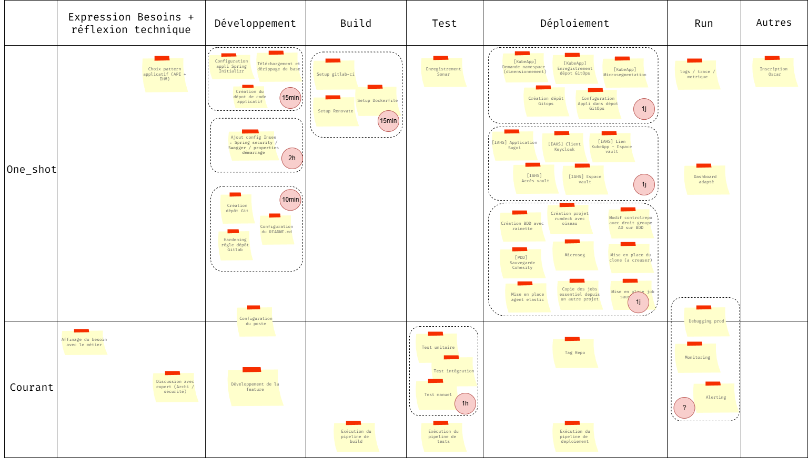

# Résultats Focus Groupe SNDIL

**Objectifs** : 

- Identifer les tâches qui prennent du temps ou de la charge coté développement
- Identifier les fonctionnalités qui pourrait intérréssé les devs dans leur pratiques quotidiennes 

**Tableau de Bord** :

## Remarques intéréssante venant des devs

### Initialisation du projet avec spring-initializr

- "C'est simple / c'est rapide"

**Rapport coût/complexité** : court et simple 

### Intégration de la configuration Insee dans le code
    
**Rapport coût/complexité** : court et simple 

- "C'est simple et rapide je m'inspire de ce qui a déjà été fait ailleurs"
- "En vrai c'est pas si facile si on ne veut pas introduire dès la création introduire de la dette technique"
- "C'est long car je repars de la doc springboot a chaque fois"

### Création du dépôt Git et hardening insee

- "C'est vite fait, c'est simple"
- "Le plus lent c'est de choisir le gitflow qu'on souhaite"

**Rapport coût/complexité** : court et simple 

### Mise en place de l'environnement de Build

- "Avec le meta component qu'on a fait c'est super simple"
- "Sans le meta component ? ce serait long compliqué et je devrais lire pas mal de doc ou je me tromperai probablement"
- "je ferai du copié collé de quelqu'un d'autre"

Remarques: 
- Il y a eu des travaux a Lille pour mettre en place un component gitlab qui serait utilisé par toute la filières. Le component intègre toutes les stages nécéssaires pour les applis.

**Rapport coût/complexité** : compliqué / long

### Mise en place de l'environnement de Tests

- "Coté filière on a des micro services et on a besoin de tester le SI dans son ensemble"
- "On fait assez peu de test unitaire cypress"
- "on utilise docker compose pour setup un environnement complet en CI pour faire des tests complets"

**Rapport coût/complexité** : compliqué / long

### Mise en place de l'environnement Runtime

- "Compliqué si on ne sait pas quel ticket ouvrir"
- "J'en oublie toujours un"
- "C'est le LeadTech ou le DevOps qui s'en charge"
- "Je ne sais pas c'est pas dans mon périmètre j'ai jamais fait"

**Rapport coût/complexité** : trés partagé, facile pour le devops, facile pour les gens qui demande au devops. Moyen dur pour le LeadTech dur pour ceux qui n'ont jamais fait

### Mise en place de la sécurité 
- "J'en oublie toujours un"
- "Pourquoi il n'y a pas un meta ticket"
- "C'est pas dur mais faut savoir quoi mettre dedans"
- "C'est long mais ca dépends pas de nous"

**Rapport coût/complexité** : trés partagé, facile pour le devops

### Mise en place de bdd (coté Ops)
- "Je demande a Eric (devops local)"
- "Si on suit la documentation c'est plutot simple"

**Rapport coût/complexité** : trés partagé, facile pour le devops

### Mise en place de l'observabilité et gestion des incidents

- "C'est fait automatiquement maintenant sur les vms"
- "C'est trop variables"
- "On peut y passer bcp de temps si on est en galère"

**Rapport coût/complexité** : trés partagé

**Remarques**: 

## Résultats

**Temps de parcours du flow sans obstacles**: 3,5 jours

**Obstacles tirés**: 
- vault inaccessible
- bug bloquant en prod
- Spring security/oidc mal configuré

**Temps de parcours du flow avec obstacles**: 5 jours

**Capabilities choisies**: 

C8: Platform Integrations (Secrets + Auth + IAM)
=> on a beaucoup d'environnement et à chaque fois cette partie est longue

C5: Environnements de test éphémères  
=> Besoin d'une recette poussée, avec de vrais environnements complets

C2: Dev Environment Standardisé
=> Volonté de tester sur son poste l'entièreté de la stack au lieu d'attendre l'ensemble du pipeline. Avoir un retour au plus tot

**Remarques** :
    => choix difficile entre toute les capabilities proposées
    => Pas de choix francs à part le IAM (mais bourrage d'urne d'une partie des gens)

**Carte évenements** :
- Incident majeur en production
=> assez peu d'effet au vu des capabilities choisies. Par contre le public a été conscient des avantages que d'autres capabilities pourrait avoir sur ce type d'événemments.
 

## Bilan

discussion annexe :

- Demande de voir ce que serait explicitement l'outil
- Remarque sur le fait que l'on fait pas si souvent de nouveaux produits. Comment la plateforme peut-elle m'aider tout de même au quotidien  ?
- Gros point d'attente sur la partie aide au débuggage / monitoring / log et sur la centralisation en un point unique
