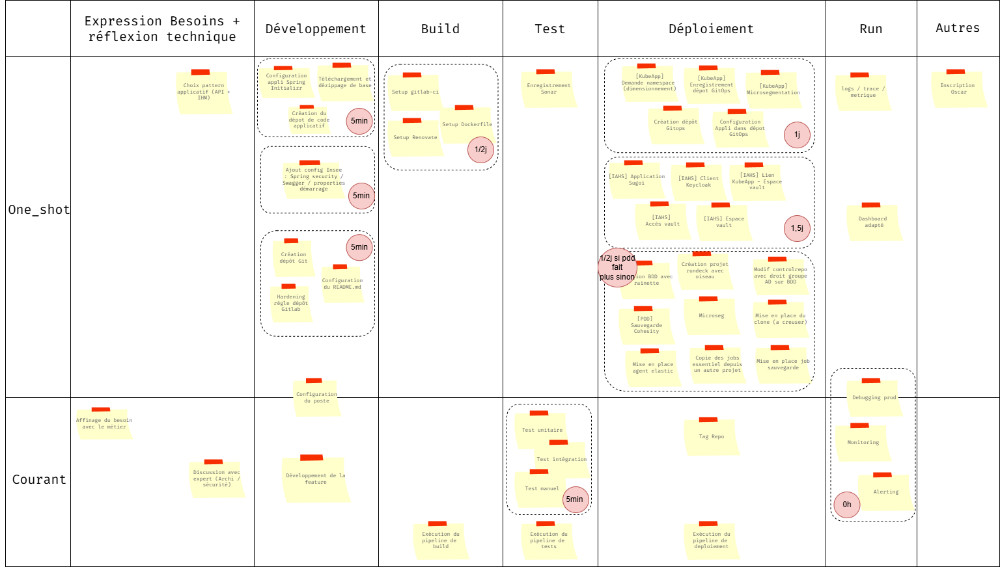

# Résultats Focus Groupe SNDIN

**Objectifs** : 

- Identifer les tâches qui prennent du temps ou de la charge coté développement
- Identifier les fonctionnalités qui pourrait intérréssé les devs dans leur pratiques quotidiennes 

**Tableau de Bord** :

## Remarques intéréssante venant des devs

### Initialisation du projet avec spring-initializr

- "Le plus long c'est de savoir quelle dépendances ont veux mettre dans le projet"

**Rapport coût/complexité** : court et simple 

### Intégration de la configuration Insee dans le code
    
- "Y en a un il fait l'investissement, les autres ont fait du copié collé"
- "Ca dépends si quelqu'un à déjà fait le travail"
- "On copie colle sans trop de question"
- "On intègre les demandes a IAHS pour la création des clients/applications ?"

**Rapport coût/complexité** : court et simple si quelqu'un l'a déjà fait, long et complexe sinon

### Création du dépôt Git et hardening insee

- Beaucoup de monde ne semblait pas au courant du truc à part les chefs de projets

**Rapport coût/complexité** : court et simple 

### Mise en place de l'environnement de Build

- "On fait du copier coller"
- "On s'inspire des autres"
- "Si notre appli est standard ca va"
- "Le plus long c'est de savoir ce que l'on veut dans le pipeline"

**Rapport coût/complexité** : long et indécis (autant de complexe que de simple) 

### Mise en place de l'environnement de Tests

- "Ecrire un test c'est simple quand l'écosystème existe déjà"
- "C'est pas trivial si il n'y a pas l'environnement et la stack déjà en place"
- "Ca peut varier de 5 min à beaucoup plus"
- "Ca dépends on parle de cucumber/cypress, ce serait bien d'uniformiser les technos"
- "Meme pour du test manuel par le métier ca peut prendre du temps"
- "La mise en place des quality gates dans sonar c'est couteux"

**Rapport coût/complexité** : indecis (ca dépends le scope) et indécis (autant de complexe que de simple) 

### Mise en place de l'environnement Runtime

- "C'est simple parce que y a de la doc"
- "J'ai jamais utilisé kube je ne saurai pas quoi faire / par ou commencé"
- "Je demande à un sachant"
- "Je sais pas"
- "Je demande sur le canal KubeApp ils sont rapide"

**Rapport coût/complexité** : indecis (ca dépends la personne) et indécis (autant de complexe que de simple) 

### Mise en place de la sécurité 

- "Je fais les tickets"
- "On fait des aller retours et parfois on doit revenir dessus car ca marche pas comme on veut"
- "On ne sait pas trop quoi faire"

**Rapport coût/complexité** : long (on dépends des gens) et indécis (ca dépends si y a des erreurs) 

### Mise en place de bdd (coté Ops)

- "Oulah c'est obscur"
- "Je demande au DBA"
- "Je demande à Anatole" => plusieurs fois
- "Je ne sais pas"
- "Je ne sais même pas qu'il y avait tout ça à faire"

**Rapport coût/complexité** : long (on dépends des gens) et indécis (ca dépends si y a des erreurs) 

### Mise en place de l'observabilité et gestion des incidents

- "Ca dépends"
- "Si y a un incident ca peut prendre 1j à 4"
- "Heuresement il y a pas trop d'incident"

**Rapport coût/complexité** : long (on dépends des gens) et indécis (ca dépends si y a des erreurs)  
**Remarques**: le 1h n'est pas représentatif

## Résultats

**Temps de parcours du flow sans obstacles**: 6 journées

**Obstacles tirés**:

- Job mal configuré
- Base données mal configuré
- Pipeline mal configuré
- Vault inaccessible

**Temps de parcours du flow avec obstacles**: 8 journées

**Capabilities choisies**: 

- C1 :  Golden Path (Template applicatif complet)
- C5 :  Environnements de test éphémères
- C10 : Observability by Default

**Remarques** :

 - C5 :arrow_right: les devs ont tiqués sur la mise en place de données de tests => fort intêret des devs
 - Les capabilities choisient ne font gagner que 2 jours 
 - Aucune carte choisie sur la simplification du mode de déploiement

**Carte évenements** :
 
 - Nouveaux Developpeurs dans l'équipe

## Bilan

- Les gens ont voté C1 - C5 - C10 peut être c'est lié à l'ordre => est ce qu'en mélangant les cartes ce vote serait le même ?
- Plus d'attente sur ce qui parle que sur ce qui ne parle pas
- Les cartes choisies ne font gagner que 2 jours sur le flux par rapport à un gain beaucoup plus important si d'autres cartes avaient été choisies.