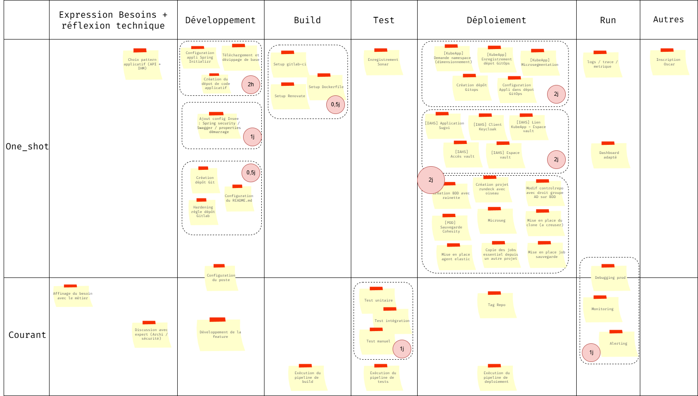

# Résultats Focus Groupe SNDIP

**Objectifs** : 

- Identifer les tâches qui prennent du temps ou de la charge coté développement
- Identifier les fonctionnalités qui pourrait intérréssé les devs dans leur pratiques quotidiennes 

**Tableau de Bord** :

## Remarques intéréssante venant des devs

### Initialisation du projet avec spring-initializr

- Utilisation du starter Lillois => Simple et rapide
- On le fait pas souvent je me rappelle pas forcement ce que je dois mettre dedans => long et complexe

**Rapport coût/complexité** : rapide et simple dans l'ensemble (à nuancer car c'est long et complexe pour ceux qui créént rarement de nouveaux projets)

### Intégration de la configuration Insee dans le code

- Utilisation du starter lillois
- Je m'inspire de quelqu'un l'ayant fait récemment
- C'est long si on repart de la doc
- on s'inspire d'une autre appli du domaine
    
**Rapport coût/complexité** : long mais simple. 

### Création du dépôt Git et hardening insee

**Rapport coût/complexité** : rapide et simple

### Mise en place de l'environnement de Build

- Utilisation du meta component lillois
- Récupération d'un autre CI de quelqu'un qui fonctionne
- Ce serait bien d'avoir un truc tout fait (mais ce serait bien de pouvoir le customiser aussi)

**Rapport coût/complexité** : simple et rapide pour tout le monde

### Mise en place de l'environnement de Tests

- Ce serait cool d'avoir un projet avec déjà la config cypress et cucumber mise en place
- intégration dans le pipeline 
- intégration automatique dans sonar, mise en place de quality gate par défaut,...

**Rapport coût/complexité** : long et plutot complexe

### Mise en place de l'environnement Runtime

- facile avec les derniers elements (charts / doc)
- compliqué de rentré dedans quand on en a jamais fait

**Rapport coût/complexité** : long (intervention humaine nécéssaire pour l'initialisation des espaces et la config initiale) plutot partagé sur la difficulté (dépend du profil et de l'expérience passée du devs)

### Mise en place de la sécurité 

- c'est pas long mais qu'est ce que c'est compliqué de savoir dans quel ordre les demander
- il y a souvent des erreurs
- on a la main en recette pour voir la config
- pourquoi pas un méta ticket ?

**Rapport coût/complexité** : rapide (j'ai juste à faire les tickets et attendre) mais compliqué et source de charge mental (il faut penser à suivre les tickets, savoir dans quel ordre les faire...)

### Mise en place de bdd (coté Ops)

- Heuresement que PDD fait bcp de choses pour nous !

**Rapport coût/complexité** : Long et complexe

### Mise en place de l'observabilité et gestion des incidents

- Compliqué à estimer
- On a les alertes kubedev
- pas facile de croiser les logs dans un monde mixte

**Rapport coût/complexité** :  ca va dépendre de l'appli (pas de tendances nettes)

## Résultats

**Temps de parcours du flow sans obstacles**: 10,5 jours

**Obstacles tirés**: 
- spring intializr mal configuré
- build fail
- nouveau dev arrive

**Temps de parcours du flow avec obstacles**: 12,5j (minimun)

**Capabilities choisies**: 

- 🟩 C1 — Golden Path (Template applicatif complet)
- 🟩 C8 — Platform Integrations (Secrets + Auth + IAM)
- 🟩 C4 — Build & Dependency Management sécurisé

**Temps de parcours du flow avec capabilities**: 8,5j

**Carte évenements** :
- E4 — Nouveau développeur arrive
- E1 — Audit sécurité surprise
 

