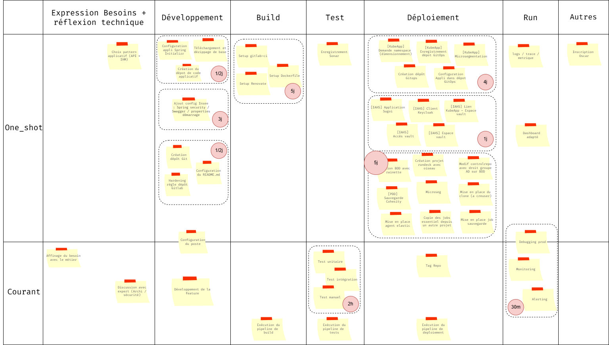

# Résultats Focus Groupe SNDIO

**Objectifs** : 

- Identifer les tâches qui prennent du temps ou de la charge coté développement
- Identifier les fonctionnalités qui pourrait intérréssé les devs dans leur pratiques quotidiennes 

**Tableau de Bord** :

### Initialisation du projet avec spring-initializr

- Faut savoir ce qu'on veut mettre dedans. Ne pas oublier certaines dépendances et ne pas se tromper dans le choix de la dépendances

**Rapport coût/complexité** : Plutôt lent mais pas difficile

### Intégration de la configuration Insee dans le code

- C'est tout le temps mais c'est pas forcément simple
- On s'inspire des autres
- On copie colle

**Rapport coût/complexité** : Plutôt lent mais pas difficile

### Création du dépôt Git et hardening insee

- Le hardening dépend des équipes
- C'est assez simple c'est du click bouton

**Rapport coût/complexité** : Plutôt rapide et simple

### Mise en place de l'environnement de Build

- Trés energivore
- Ca ne fonctionne jamais du premier coup
- c'est pénible faut pousser et attendre que ca tourne
- l'évolution et le MCO/MCS est compliqué
- c'est souvent pareil mais y a tjs des trucs à changer 

**Rapport coût/complexité** : Lent et complexe

### Mise en place de l'environnement de Tests

- Si l'environnement est en place c'est pas trop dur.

**Rapport coût/complexité** : Lent et complexe

### Mise en place de l'environnement Runtime

- C'est couteux en charge cognitive car il faut suivre l'avancement des tickets mais rapide en terme de temps passé
- La mise en place du dépôt gitops / la demande initiale a kubeapp n'est pas facile

**Rapport coût/complexité** : lent et complexe

### Mise en place de la sécurité 

- C'est couteux en charge cognitive car il faut suivre l'avancement des tickets mais rapide en terme de temps passé
- C'est compliqué de savoir dans quel ordre les demander

**Rapport coût/complexité** : lent et complexe

### Mise en place de bdd (coté Ops)

- J'ai ma fiche mode opératoire pour m'accompagner
- On le fait nous même mais pas tout les jours et c'est long de suivre le mode opératoire
- Y a des aspects qui sont obscure
- Enfin un récap de tout ce qu'il faut faire

**Rapport coût/complexité** : lent et complexe

### Mise en place de l'observabilité et gestion des incidents

**Remarques**: Ca dépends de l'appli mais si pas d'incident ca va. => On n'est passé assez vite car pas concerné.

**Rapport coût/complexité** : lent et complexe 

## Résultats

**Temps de parcours du flow sans obstacles**: *18 jours

**Obstacles tirés**:

- Spring initializr mal configuré (+1/2j)
- Job Manquant coté BDD (+1 à 2 journées)

**Temps de parcours du flow avec obstacles**: 20 jours

**Capabilities choisies**: 

C3 - CI/CD Pipeline Standard
C2 - Dev Environment Standardisé
C1 - Golden Path (Template applicatif complet)

**Remarques** :

* Impact sur le flow => Passage de 20-22 jours à 14/15 jours
* Le choix de l'environnement de développement standardisé n'a pas bcp d'impact car non évalué dans le modèle de l'activité présenté mais représente un fort gain pour les équipes.

**Carte évenements** :
- Audit sécurité surprise => partiellement réglé par les capabilities C3 et C1
- Migration cloud => partiellement réglé par les capabilities C3 et C1

## Bilan

De nombreux sujets ont été abordés en plus de ceux présentés ci dessus: 

- Configuration du poste couteuse:

    - setup initial
    - envirronnement façon dev conteneur
    - demande d'uniformisation des outils mis à disposition : intellij-ultimate vs intellij / développeur avec licence mistral vs rien
    - podman préconfiguré pour intégration dans l'environnement insee

- Différence poste vs ci:

    - Demande d'avoir la possibilité de faire du podman compose dans les ci pour reproduire les tests locaux

- Les développeurs ne sont pas au courant de certaines features déployées par la production : 

    - chart workflow
    - client keycloak configuré pour le localhost
 
- Manque de visibilité / capacité sur les outils configurés coté ops:

    - demande de capture d'écran sur la configuration keycloak => manque d'auditabilité de la configuration
    - configuration en autonomie du client keycloak
    - Auditabilité des droits d'un compte de service keycloak ? Comment faire ?

- Manque de découvrabilité de la documentation:

    - Des aspects de l'offre non documenté: certains concepts dans sugoi ne sont pas clairs ?
    - Pas de documentation simple et compréhensible par un non expert.
    - manque de mode-opératoire transverses

- Le board est apprécié par les devs car il sert de récapitulatif global de l'ensemble des tâches à réaliser

