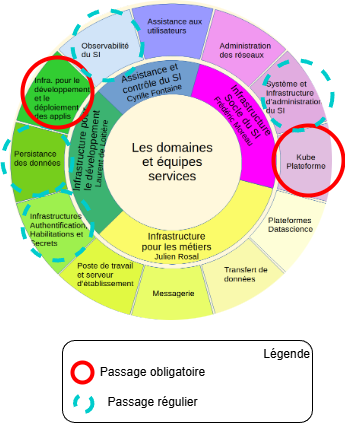

# Panorama des acteurs à disposition des développeurs

## Le monde des Ops

Depuis 2023, le département de la production informatique s'est organisé en mode produit. Chaque équipe de production à un domaine de responsabilité et propose une offre de service en accord avec son domaine de responsabilité.

|                                             |
| --------------------------------------------------------------------- |
| _Roue de la production: interraction developpeur et équipes services_ |

Les développeurs sont en contacts direct avec les équipes:

- Infra pour le développement et le déploiement d'application des applis (IDDA) quand il souhaite déployer une application dans le monde VM
- KubePlateforme lorsqu'il souhaite déployer une application dans le monde Kubernetes.

Ces équipes servent de guichet pour les développeurs et de support sur leur offre de service.

!!!info

    Certaines équipes de développement ont des stacks mixtes se répartissant entre infrastructure VM et Kubernetes.

Les développeurs sont également en contact régulier avec :

- L'équipe persistence des données (PDD): pour la mise à disposition d'une ou plusieurs bases de données
- L'équipe infrastructure authentification, habilitation et gestion des secrets (IAHS): pour le stockage et la récupération des secrets pour leur application ou pour configurer le fournisseur d'identité
- L'équipe réseau: pour l'exposition des applications et l'obtention de certificats.
- L'équipe observabilité: pour la surveillance, monitoring des applications

Chacune des équipes est:

- autonome dans le choix des technologies qu'elles proposent
- responsable de la documentation de son produit
- responsable d'un canal tchap `contactez-nous`
- indépendante

Toutes ces informations sont disponibles ici : https://prod.gitlab-pages.insee.fr/info/index.html

## Les équipes transverses

Des équipes support transversale interviennent également:

- L'urbanisation: donne les bonne pratiques dans le nommage des services, s'assure de la cohérence du SI
- Les architectes : dispose d'une bonne connaissance des offres de services de la prod, et accompagne les équipes dans la conception de leur application a partir des contraintes de performances / sécurité.
- La DSMR: La sécurité, accompagne les applications dans l'identification des risques autour de leur application et leur correction.

!!!info

    En pratique les architectes sont surtout utilisés en phase de conception, la sécurité en fin de projet, quand l'application est prête à être ouverte aux utilisateurs (pour l'homologation).
