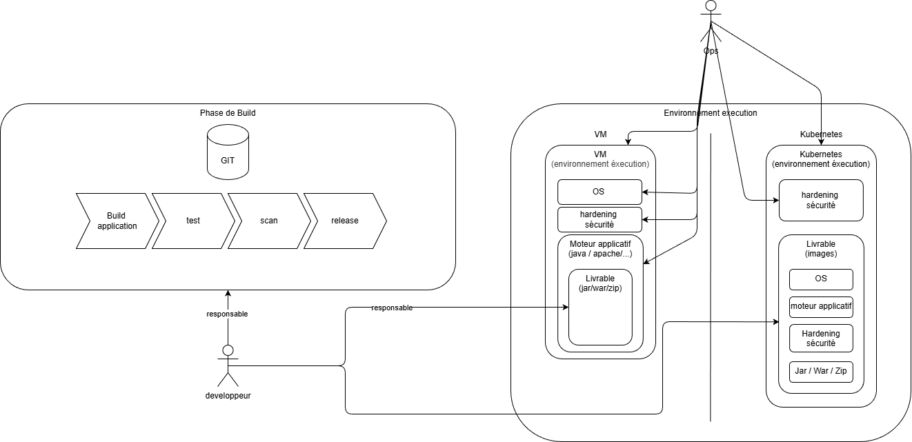

# Zoom : Rôles et responsabilités autour de l’infrastructure et du delivery

Peu importe l'environnement de déploiement, les développeurs sont responsables de:

- Développer de leur application
- Mette en place de l'automatisation autour de leur dépôt de code (Continuous Integration) : lint, build, test unitaire, test intégration, scan de CVEs, et dépôt de livrable.
- Construire leur plateforme: mise en place de la plateforme qui herbegera leur application.
- Configurer de la plateforme (plus ou moins complexe suivant la technologie sous jacente)
- Déployer le livrable

Les équipes de la production ont pour mission de proposer aux développeurs des outils afin de leur faciliter la construction et le déploiement de leur application.

En fonction de l'environnement de déploiement choisi la responsabilité du dev et de l'Ops varient.

- Une offre VM Ops-Centric (_"Les Ops fournissent l’infrastructure et continuent d’opérer les applications »"_)
  - Ce que font les dev:
    - Dépose le livrable quelque part
    - Utilise des services 'maison' pour la mise en place de l'application. Le dev peut utiliser ces services pour de la gestion simple de sa plateforme.

  - Ce que font les ops:
    - La gestion des couches sous-jacentes (version du moteur applicatif, OS, sauvegarde).
    - En cas d'incident sur l'environnement le développeur peut soliciter l'équipe de prod pour la résolution de l'incident.

!!!warning "Impacts"

    - :x: Forte dépendance des Dev aux Ops en particulier pour une offre non standard
    - :x: Risque de goulot d’étranglement (tickets, délais, files d’attente)
    - :x: Ops restent en mode Run / MCO applicatif (peut être le quantifier)
    - :x: Responsabilités floues (qui est responsable de quoi ?)
    - :x: Service maison non standard, non portable

- Une offre Kubernetes "Platform-centric" :
  - Ce que font les devs:
    - Build leurs images applicatives à partir des base images
    - Déploient eux-mêmes via pipelines / GitOps
    - Gèrent les versions applicatives
    - Sont responsables du cycle de vie de leur runtime

  - Ce que font les ops:
    - Fournissent une plateforme Kubernetes sécurisée et opérée
    - Proposent des images de bases certifiées, renforcées, et adaptées à l'environnement Insee.
    - Fournissent des environnements d'éxecution standardisés et reproductible.
    - Proposent des templates facilitant le déploiement
    - Mettent à disposition des services que les développeurs utilisent pour le déploiement de leur application.
    - Accompagnent à l'appropriation des outils
    - Accompagnent à la résolution des bugs liés outils

!!!warning "Impacts"

    - :heavy_check_mark: Responsabilités claires (Ops = plateforme, Dev = application)
    - :white_check_mark: Forte autonomie des équipes Dev
    - :white_check_mark: Réduction massive de la charge MCO applicative côté Ops
    - :white_check_mark: Scalabilité organisationnelle
    - :white_check_mark: Time-to-market plus rapide
    - :x: Charge cognitive des devs :chart-with-upwards-trend:

!!!info

    Cette différence de fonctionnement est en partie liée au choix des outils et à la maturité des équipes services.
    L'offre Kube n'existe que depuis 3 ans alors que l'offre VM existe depuis presque 20 ans (/todo a confirmer).

|  |
| ---------------------------------------------- |
| _Schema comparatif responsabilite dev/ops_     |

!!!warning "Conclusion"

    - des pratiques/outils de dev assez homogènes
    - des disparités dans le ci
    - bcp d'outils/pratiques différentes pour le déploiement => besoin d'homogénéisation