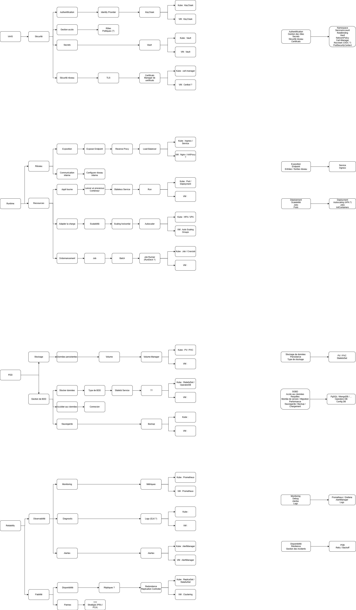

# Schéma

Ce schéma montre comment s'organisera le Golden Path et de quelles manières les **"équipes Capabilities"** communiqueront.

------------------------------------------------------------------------

## IAHS

L'équipe **IAHS** (**Identity & Security**) sera en charge de l'aspect **Sécurité** du Golden Path.

En particulier, elle aura la responsabilité de gérer :

- Les problèmes d'authentification
- Les identités et les rôles
- L'accès aux secrets
- La sécurisation des flux réseau
- Les certificats / TLS

------------------------------------------------------------------------

## Runtime

L'équipe **Runtime** (**KubeApp + IDDA**) sera en charge des aspects **Réseau**, **Ressources** et **Stockage** du Golden Path.

En particulier, elle aura la responsabilité de gérer :

- **Réseau** :
  - L'exposition d'une application
  - La configuration d'un endpoint HTTP
  - Les entrées et sorties réseau
- **Ressources** :
  - Le déploiement d'une application
  - La scalabilité
  - L'exécution des jobs
  - Le cycle de vie des pods
- **Stockage** :
  - Le stockage des données
  - La persistence des données
  - Le choix du type de stockage (S3, ...)

------------------------------------------------------------------------

## PDD

L'équipe **PDD** (**Data Services**) sera en charge de l'aspect **Base de données** du Golden Path.

En particulier, elle aura la responsabilité de gérer :

- Le choix d'une base de données (PostgreSQL, MongoDB, ...)
- L'accès aux données
- Les performances des requêtes
- Les sauvegardes / Backup / Restaurations

------------------------------------------------------------------------

## Reliability

L'équipe **Reliability** (**Observabilité**) sera en charge des aspects **Observabilité** et **Fiabilité** du Golden Path.

En particulier, elle aura la responsabilité de gérer :

- **Observabilité** :
  - Le monitoring des applications
  - Le debugging
  - Le système d'alertes
  - Les logs
- **Fiabilité** :
  - La haute disponibilité
  - La résilience
  - Les incidents
