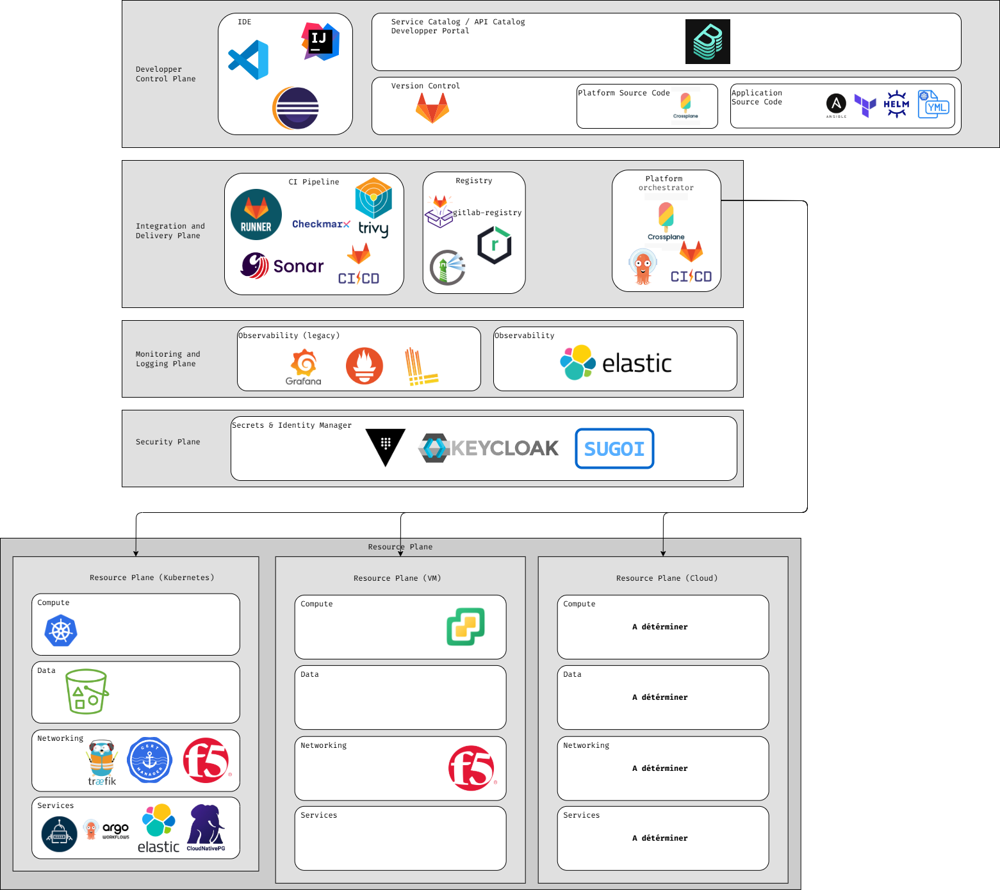

# ADR-007 - Architecture applicative DevExperience

| | |
|---|---|
| **Référence** | ADR-007 |
| **Statut** | Proposé : en cours de validation |
| **Auteurs** | Équipe DevExperience |
| **Public** | Équipe DevExperiencee · équipes capabilities · architectes du SI · décideurs SI |

## Contexte

Le but de cet ADR est de proposer l'ensemble des briques applicatives qui pourrait constituer le périmètre de l'équipe DevExperience.

## Proposition

### Lecture d'ensemble du schéma

Le schéma reprend la **reference architecture du CNCF Platform Engineering** (whitepaper *Platforms White Paper*), organisée en cinq plans :

| Plan | Rôle | Ce que vous y avez placé |
|------|------|--------------------------|
| **Developer Control Plane** | Là où le dev interagit | IDE (VS Code, IntelliJ, Eclipse), portail (Backstage), GitLab, Crossplane, Helm/YAML |
| **Integration & Delivery Plane** | Construit, stocke, déploie | GitLab Runner (CI), Nexus + scanner (Registry), ArgoCD + Crossplane (CD) |
| **Resource Plane** | Les ressources réelles | Kubernetes (Compute), MinIO/S3 + CloudNativePG (Data), Networking *(vide)*, Services *(vide)* |
| **Monitoring & Logging Plane** | Observabilité | Grafana + Prometheus + logs (Loki ?), Elastic |
| **Security Plane** | Identité & secrets | Vault, Keycloak, SUGOI |

Le domaine de responsabilité de l'équipe DevExpérience (ie le domaine sur lequel l'équipe devra assurer le MCO/MCS) est représenté par un fond en pointillé. Les autres briques ne sont pas maintenues par l'équipe mais l'équipe doit être en capacité de pouvoir les utiliser/intégrer.

#### Developer Control Plane — l'expérience développeur

**IDE (VS Code, IntelliJ IDEA, Eclipse)**
Environnement où le développeur écrit son code. *Utilité* : ce sont les outils existants des équipes, la plateforme ne les impose pas, elle s'y connecte. *Impact* : en y branchant plus tard devcontainers et extensions plateforme, on rapproche le self-service du poste de travail et on réduit la charge cognitive dès la première ligne de code.

**Backstage (Service Catalog / Developer Portal)**
Portail développeur : catalogue des composants/API, scaffolding (création de projet à partir de templates), documentation (TechDocs), liens vers les outils. *Utilité* : c'est le **point d'entrée unique** que votre modèle organisationnel appelle de ses vœux — il remplace le « je demande à Anatole ». *Impact* : transforme une collection d'outils en une plateforme cohérente ; c'est le visage de la démarche pour les 250 devs.

**GitLab (Version Control)**
Hébergement du code et des dépôts GitOps, moteur de CI. *Utilité* : source de vérité du code *et* de la configuration déployée. *Impact* : socle de toute la chaîne ; les MR automatiques générées par les templates Backstage y atterrissent.

**Crossplane (Platform Source Code)**
Définit, en YAML Kubernetes, des **abstractions d'infrastructure** (Compositions, XRD) que les devs consomment sans connaître la mécanique sous-jacente. *Utilité* : permet d'offrir « une base de données » ou « un bucket » comme un service self-service, avec des garde-fous intégrés. *Impact* : c'est la brique qui fait passer d'une plateforme de déploiement à une plateforme de *provisioning*. (À clarifier dans le schéma : sa place est dans le Resource Plane.)

**Helm / YAML / (Application Source Code)**
Packaging et configuration des applications déployées sur Kubernetes. *Utilité* : standardise la façon dont une appli est décrite et installée. *Impact* : un chart Helm standard maison = un golden path de déploiement reproductible pour toutes les équipes.

**Terraform / Ansible / (Application Source Code)**
Packaging et configuration des applications déployées sur VM en interne ou sur le cloud. *Utilité* : standardise la façon dont une appli est décrite et installée. *Impact* : Des fichiers de config standard maison = un golden path de déploiement reproductible pour toutes les équipes.

#### Integration & Delivery Plane — la chaîne de livraison

**GitLab Runner (CI Pipeline)**
Exécute les pipelines : build, tests, scan, publication d'images. *Utilité* : automatise le passage du code à un artefact prêt à déployer. *Impact* : des pipelines standardisés (fournis par la plateforme) suppriment le copier-coller de `.gitlab-ci.yml` de projet en projet.

**Nexus (Registry)**
Stocke les artefacts : images de conteneurs, paquets, dépendances. *Utilité* : référentiel central, versionné, des livrables. *Impact* : point de passage obligé entre build et déploiement ; permet la traçabilité et le cache des dépendances.

**Scanner de vulnérabilités (Trivy ou équivalent)**
Analyse les images à la recherche de CVE. *Utilité* : détecte les failles avant la mise en production. *Impact* : maillon de la supply chain security ; sa valeur est démultipliée s'il est branché à une *gate* qui bloque les déploiements vulnérables.

**ArgoCD (CD Pipeline)**
Moteur **GitOps** : il réconcilie en continu l'état des clusters avec ce qui est décrit dans Git. *Utilité* : tout déploiement passe par une modification Git, auditable et réversible. *Impact* : pierre angulaire du déploiement continu ; couplé à Argo Rollouts, il rend les mises en prod sûres.

**Crossplane (côté CD)**
Provisionne l'infrastructure demandée au fil des déploiements. *Utilité* : étend le GitOps au-delà des applis, jusqu'aux ressources (bases, buckets, etc.). *Impact* : unifie « déployer une appli » et « provisionner ce dont elle a besoin » dans un même flux déclaratif.

#### Resource Plane — les ressources réelles

**Kubernetes (Compute)**
Orchestrateur de conteneurs : exécute, scale et supervise les workloads. *Utilité* : c'est le runtime cible de la plateforme. *Impact* : socle d'exécution commun ; toute la valeur self-service se déploie *dessus*.

**MinIO / S3 (Data)**
Stockage objet compatible S3. *Utilité* : buckets pour les applis, les sauvegardes, la publication TechDocs. *Impact* : service de données mutualisé, déjà utilisé largement chez vous.

**CloudNativePG (Data)**
Operator PostgreSQL pour Kubernetes : provisionne et gère des bases en mode déclaratif (HA, backup, restauration). *Utilité* : « une base PostgreSQL » devient un objet Kubernetes self-service. *Impact* : brique clé du « BDD as code » que vise la capability team Data.

**Networking *(à compléter)***
Exposition des services, certificats, DNS, éventuellement mesh. *Utilité* : rendre une appli accessible et sécurisée sans ticket. *Impact* : sans cette couche, le self-service s'arrête à la porte du cluster.

**Services *(à compléter)***
Services managés provisionnés à la demande (messaging, cache, etc.). *Utilité* : offrir le catalogue de ressources dont les applis ont besoin. *Impact* : c'est la matérialisation concrète du self-service infra.

#### Monitoring & Logging Plane — l'observabilité

**Grafana**
Visualisation : dashboards de métriques, logs et (potentiellement) traces. *Utilité* : donne aux devs la visibilité sur l'état de leurs applis. *Impact* : self-service d'observabilité = moins de tickets vers l'équipe Observabilité.

**Prometheus**
Collecte et stockage de métriques, base de l'alerting. *Utilité* : mesure la santé et la performance des workloads. *Impact* : fondation des SLO et des DORA metrics qui pilotent la démarche.

**Loki (ou équivalent — agrégation de logs)**
Centralise les logs des applications. *Utilité* : recherche et corrélation des logs sans accès direct aux pods. *Impact* : accélère le diagnostic d'incident, autonomise les équipes.

**Elastic**
Moteur de recherche / analytics de logs (et parfois APM). *Utilité* : recherche avancée et rétention longue. *Impact* : à positionner clairement vis-à-vis de la stack Grafana pour éviter le doublon perçu.

#### Security Plane — identité & secrets

**Vault (Secrets Manager)**
Coffre-fort des secrets (mots de passe, clés, certificats). *Utilité* : élimine les secrets en clair dans le code et le GitOps. *Impact* : prérequis de toute plateforme partagée ; gagne à être couplé à External Secrets Operator pour la distribution aux clusters.

**Keycloak (Identity Manager)**
Fournisseur d'identité OIDC : authentification unique (SSO) pour le portail, ArgoCD, Grafana, etc. *Utilité* : un seul login, une gestion centralisée des accès. *Impact* : socle du RBAC plateforme (groupes Keycloak → rôles) ; condition de l'expérience « point d'entrée unique ».

**SUGOI**
Référentiel d'identités de l'Insee. *Utilité* : source de vérité des personnes et groupes, fédérée vers Keycloak. *Impact* : ancre la plateforme dans l'écosystème d'identité maison plutôt que de créer un annuaire parallèle.

