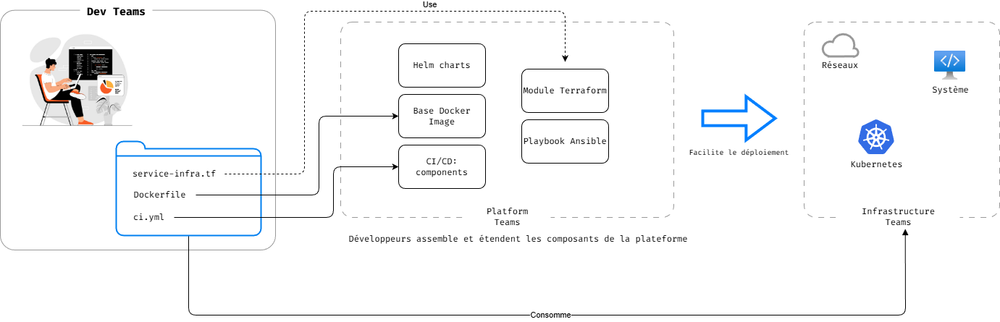
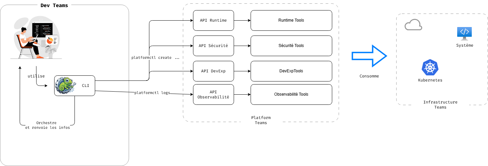
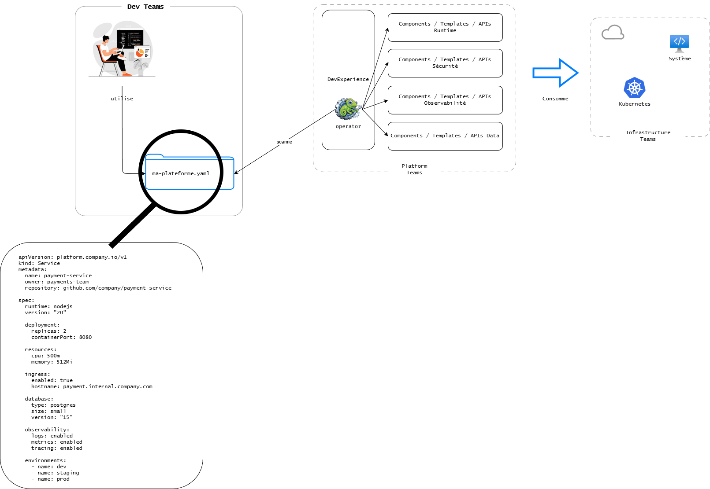
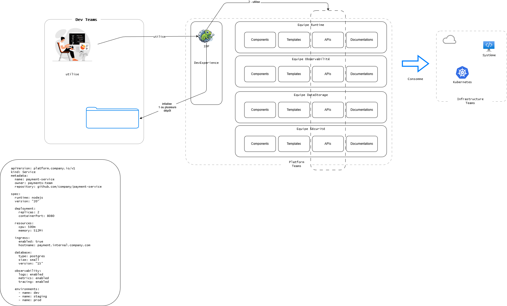

# ADR-008 - Format de la plateforme : combinaison IDP + GitOps + API/CLI + Libraries

| | |
|---|---|
| **Référence** | ADR-008 |
| **Statut** | Proposé : en cours de validation |
| **Auteurs** | Équipe DevExperience |
| **Public** | Équipe DevExperiencee · équipes capabilities · architectes du SI · décideurs SI · utilisateurs |

## Contexte

L'équipe Platform Engineering doit décider de la manière dont les capacités de la plateforme sont exposées et consommées par les équipes applicatives. Plusieurs modèles existent dans l'industrie, chacun avec ses forces et ses faiblesses.

### Capacités attendues de la plateforme

La plateforme doit permettre :

- Un point d'entrée unique vers les éléments constituant le périmètre d'une application : dépôt Git, dépôt GitOps, informations Oscar / Analyzer / Compas, état du déploiement, accès logs et métriques
- La centralisation de la documentation des outils de production
- Des outils de debug et de développement
- L'observabilité
- Le self-service opérationnel

### Critères de choix

- Solution facilement adoptée par tous les profils de développeurs
- Centralisation : éviter la dispersion de l'information
- Le moins proche de l'Ops possible (réduire la charge cognitive — voir ADR-001)
- Compatible avec l'existant (KubeApp, ArgoCD, GitLab CI, Vault)

## Options envisagées

Quatre modèles d'exposition de la plateforme ont été étudiés.

### Option A — Platform as Libraries

La plateforme est consommée via des libraries (charts Helm, playbooks Ansible), modules Terraform et CI components.

**Avantages** : flexible, simple à mettre en place, rapide, proche de l'existant.

**Inconvénients** : risque d'être trop Ops, assemblage à la guise des devs, peu de gouvernance, UX faible, dépendance à la documentation d'assemblage.

### Option B — API Platform

La plateforme expose ses capacités via API et CLI maison.

**Avantages** : scalabilité simple, automatisation, flexibilité.

**Inconvénients** : UX faible à moyenne, documentation indispensable, coût de développement d'une CLI maison, risque d'usine à gaz (cf. Crapaud / Rainette), risque d'être encore trop Ops, risque de surcouche sur des CLIs déjà existantes (kubectl).

### Option C — GitOps Platform

La plateforme est consommée via Git. Le développeur déclare ce qu'il veut dans un repo, la plateforme l'applique via des opérateurs.

**Avantages** : très traçable, aligné avec GitOps, scalable, niveau d'abstraction défini par les YAML.

**Inconvénients** : UX moyenne pour dev non-infra, nécessite de bonnes abstractions, nécessite le développement d'opérateurs (Go, Crossplane), complexité de fonctionnement, niveau de maturité requis élevé.

C'est globalement ce que propose déjà l'équipe KubeApp.

### Option D — Internal Developer Platform (IDP)

Un portail central devient l'interface principale pour découvrir, utiliser et opérer la plateforme.

**Avantages** : excellente expérience développeur, self-service complet, visibilité des services, gouvernance, user-friendly.

**Inconvénients** : plateforme lourde à construire (compétences front + back), maintenance élevée, nécessite une maturité organisationnelle (coordination capability teams ↔ Platform Experience).

### Bilan comparatif

## Décision

Nous retenons une **combinaison des quatre approches**, avec un rôle spécifique pour chacune.

| Interface | Usage principal | Outil retenu |
|-----------|-----------------|--------------|
| **IDP** | UX développeur, point d'entrée unique | Backstage |
| **GitOps** | Provisioning d'infrastructure | ArgoCD + Helm (existant KubeApp) comme moteur de synchronisation, **Crossplane** comme moteur d'orchestration (control plane) pour les ressources gouvernées en continu |
| **API / CLI** | Automatisation, intégration en pipeline | CLI Golden Path (Python/Typer + Copier), API Backstage |
| **Libraries** | Composants réutilisables | GitLab CI components, charts Helm, modules existants |

### Rôle de chaque interface

#### IDP (Backstage) — interface principale

L'IDP constitue **le point d'entrée unique** pour les développeurs. Il agrège et expose :

- Le catalogue de services (composants, owners, dépendances)
- La documentation centralisée (TechDocs)
- Les Golden Paths (Scaffolder)
- Les dashboards de santé des services (plugins ArgoCD, Grafana)
- L'annuaire des équipes et le feed des changements

C'est l'interface qui matérialise les ADR-001 (périmètre fonctionnel) et ADR-006 (modèle de support self-service).

#### GitOps — provisioning d'infrastructure

L'approche GitOps (ArgoCD + Helm) est conservée pour le **déploiement et la gestion des ressources d'infrastructure**, en s'appuyant sur l'existant KubeApp. Le développeur ne manipule pas directement les YAML : ils sont générés par les Golden Paths et accessibles via l'IDP.

Un portail seul ne suffit pas à couvrir ce rôle dans la durée : l'IDP est excellent pour le **day 0** (générer un dépôt, une première configuration), mais ne gère pas le **day 2** (évolutions, mises à jour, conformité dans le temps). C'est pourquoi l'interface GitOps s'appuie sur un **moteur d'orchestration** — un control plane qui maintient en continu l'état réel conforme à l'état déclaré, plutôt que d'appliquer une suite d'étapes une seule fois (à la différence d'un script ou d'un pipeline classique). L'outil retenu pour ce rôle est **Crossplane** (voir [POC Crossplane](../pocs/crossplane.md)) : il reçoit la demande déposée en Git par l'IDP (une Claim), provisionne les ressources correspondantes, puis les gouverne en continu — la mise à jour d'une Composition se propage automatiquement à toutes les instances existantes, sans migration dépôt par dépôt.

#### API / CLI — automatisation

Une **CLI Golden Path** (Python/Typer + Copier) permet la création de projets en ligne de commande, complémentaire à l'IDP. Les API de Backstage exposent le catalogue et les opérations programmatiquement pour les besoins d'automatisation et d'intégration en CI.

#### Libraries — composants

Les **GitLab CI components**, **charts Helm** et **modules Terraform** constituent la base de composants réutilisables. Ils sont assemblés par les Golden Paths pour fournir des configurations standardisées, en s'appuyant sur les initiatives existantes :

- Templates : `gitlab.insee.fr/animation-developpement/templates`, `gitlab.insee.fr/kubernetes/forum/exemples`
- CI components : `gitlab.insee.fr/kubernetes/kubeapp/component`, `gitlab.insee.fr/idda/applications/nexus/pipeline-admission/nexus-ci-component`, `gitlab.insee.fr/sndi-lille/ressources-communes/components/`
- Component déploiement : `gitlab.insee.fr/kubernetes/charts`

### Pourquoi cette combinaison plutôt qu'une seule interface ?

Aucune des 4 approches prises isolément ne couvre l'ensemble des besoins :

- **IDP seul** : ne couvre pas l'automatisation programmatique ni les composants réutilisables côté équipes avancées. Il facilite l'initialisation mais pas le MCO/MCS au cours du temps
- **GitOps seul** : UX trop technique pour le Persona "Consommateur"
- **API/CLI seul** : pas assez user-friendly, ne couvre pas la découvrabilité
- **Libraries seul** : pas de gouvernance, pas de point d'entrée unique, dépend de la documentation

La combinaison permet de **servir les 3 personas** (Consommateur via l'IDP, Contributeur via API/CLI/Libraries, Manager via les vues IDP) tout en s'appuyant sur l'existant (KubeApp, ArgoCD).

## Conséquences

**Positif :**

- Couverture complète des besoins identifiés au constat terrain
- S'appuie sur l'existant (KubeApp/ArgoCD, GitLab CI components, charts Helm) sans rupture
- Sert les 3 personas : UX simplifiée pour le Consommateur, accès programmatique pour le Contributeur, vue transverse pour le Manager
- Backstage comme IDP open-source mature → pas de développement from scratch d'un portail
- Permet une montée en puissance progressive (commencer par l'IDP en Phase 1, étendre les automatisations en Phase 3)

**Négatif :**

- Construction et maintenance plus complexes qu'une approche unique (compétences front + back + ops nécessaires dans l'équipe Platform Experience)
- Nécessite une bonne coordination entre l'équipe Platform Experience et les capability teams
- Risque de duplication si les frontières entre les 4 interfaces ne sont pas claires (ex : faire en CLI ce qui est déjà dans l'IDP)
- Maintenance d'une CLI maison à long terme (cf. retour d'expérience Rainette)

**Lien avec les ADR existantes :**

- Concrétise techniquement l'[ADR-001](./adr-001-perimetre-fonctionnel.md) (périmètre fonctionnel)
- Permet le modèle de support défini dans l'[ADR-006](./adr-006-modele-support.md) (self-service via l'IDP)
- Le moteur d'orchestration retenu pour l'interface GitOps est détaillé dans le [POC Crossplane](../pocs/crossplane.md)
