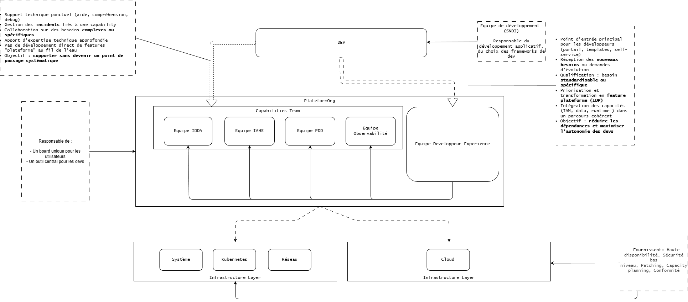
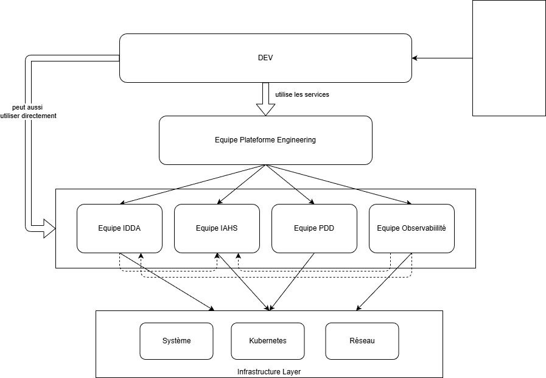

# ADR: Proposition organisation pour PlateformEngineering

**Objectifs**: Identifier la meilleure organisation pour mettre en place un produit de type plateform Engineering

## Statut

Proposé

## Contexte

**Glossaire:**

- Equipe Plateforme: D'après TeamTopologies une équipe est qualifiée de `platform teams` si elle coche les critères suivants:
  - Exposent des API (X-as-a-service)
  - Fournissent du self-service
  - Ont de la documentation
  - Ont une roadmap produit interne
  - Mesurent l’adoption
- PlateformEngineering: Mode d'organisation des équipes de la production en mode produit visant à fournir aux développeurs un service unifié visant à réduire leur charge coginitive en réduisant les acteurs ainsi que le nombre d'outil devant être maitrisé par les devs.

**Equipe dont le périmètre est candidats pour intégrer la plateform engineering**:

- IDDA
- KubeApp
- PDD
- IAHS
- _Observabilité_ 
- _STD_
- _Réseau_

**Constats actuel** :

- Les équipes Ops sont organisées en équipes services et ont un périmètre restreint.
- Les équipes services sont dépendantes les unes des autres
- Les devs peuvent livrer/déployer en prod en autonomie de manière plus ou moins indépendante:
- Besoin de coordination entre équipe Ops, le dev est l'orchestrateur

**Evaluation purement subjective de la maturité au sens teamTopology des équipes services** :

|               | API                      | self-service | documentation | roadmap | Mesurer adoption |
| ------------- | ------------------------ | ------------ | ------------- | ------- | ---------------- |
| IDDA          | ✅                       | ✅           | ✅            | ✅      | ❌               |
| KubeApp       | ⏳                       | ✅           | ✅            | ✅      | ⏳               |
| PDD           | ⏳ (par le biais d'IDDA) | ⏳           | ✅            | ✅      | ❌               |
| Observabilité | ❌                       | ❌ (tickets) | ⏳            | ✅      | ❌               |
| IAHS          | ❌                       | ❌ (tickets) | ✅            | ✅      | ❌               |

La consommation des capabilities par la plateforme n'est pas obligatoire pour le développeur.

### Team Topologies

Team Topologies est un framework organisant les équipes pour maximiser le flux de valeur et réduire la charge cognitive.

Il repose sur **4 types d'équipes** :

- Stream-aligned (produit => équipes développement à l'Insee)
- Platform (services internes => les équipes de la roue de la prod)
- Enabling (équipes support => architectes, urbaniste, sécurité,...)
- Complicated-subsystem (équipes type expertise => la diit, les archis).

**3 modes de travail entre ces équipes:**

- Collaboration : les équipes s'entraide et travail ensemble
- X-as-a-Service : l'équipe consomme les services de l'autre équipe en mode self-service
- Facilitating : Equipes d'experts souvent temporaire qui vise à aider les autres équipes sur certains domaines.

**Principes :**

- Réduire la charge des stream-aligned
- team-first : l'organisation s'adapte aux équipes, et non l'inverse
- fast flow.
- Eviter Conway's Law : architecture reflète communication
- Si 2 équipes collabore fortement elles sont censés être dans la même `équipe`.

L'organisation des équipes actuellement en place au sein du DPII présage d'une organisation en mode n equipes-platform.

### Platformengineering.org

Organisme de référence dans le milieu de la plateform engineering. Reprends les principes de TeamTopology et ajoute le fait que les stream-aligned team ne doivent être en contact qu'avec une seule équipe. Cette équipe doit faire en sorte que cette équipe plateforme doit être orienté en mode produit avec la notion de dev expérience au centre.

L'organisme introduit les notions suivantes :

| Terme                     | Nature                                             |
| ------------------------- | -------------------------------------------------- |
| Platform Team             | Type d’équipe (structure)                          |
| Platform Engineering      | Discipline / approche produit                      |
| Platform Engineering Team | Platform Team mature avec mindset produit          |
| Capability Team           | Responsable de la disponibilité du service managé. |

L'objectif du plateforme engineering est de fournir une offre cohérente au développeur avec un point d'entrée unique. Le développeur n'a pas à connaitre qui gère quoi.

La mise en place du platform engineering est d'abord un mode d'organisation.

### Proposition

#### Organisation

Proposition d'organisation cible :

- Une "meta-equipe plateform" composée de plusieurs sous équipes (Team Capability) avec des experts sur les sujets dont ils ont la responsabilité.
- Une nouvelle équipe 'PlatformExperience', elle est la seule interface pour les devs et elle est la vitrine du produit plateforme.
- Des 'équipes capabilities' qui fournissent du services sous forme d'API / templates terraform. Mais qui ne traitent plus de tickets de Run. Si l'on souhaite coller au modèle proposé par le platformengineering.org on peut structurer les équipes de la manière suivante en fonction des capabilities fournies :
  - Compute & Runtime: IDDA + KubeApp
  - Identity & Security: IAHS
  - Data Services: PDD
  - Reliability & Feedback : OBSERVABILITÉ
  - (Plateform Experience) : à définir
- Les nouveaux besoin passe par l'équipe PlatformExperience qui ensuite transmet les besoins aux différentes équipes capabilities. L'objectif est d'éviter qu'une équipe optimise sur son périmètre sans vision d'ensemble.
- Un produit global (la plateforme) dont la vitrine est la DeveloperPlateforme.
- Des équipes alignées sous un but commun "rendre du service à l'utilisateur"

!!!info "Place des POs capabilities et PO DevExp"

    Le PO DevEx (Developer Experience) est le principal point de contact des développeurs. Il comprend leurs besoins, leurs irritants et leurs usages quotidiens. Il porte une vision globale de l’expérience développeur et transforme ces besoins en fonctionnalités de plateforme cohérentes, standardisées et priorisées. Son objectif est de permettre aux développeurs d’être autonomes via la plateforme, sans avoir à interagir en permanence avec de multiples équipes techniques.
    
    Les PO des capability teams (data, IAM, runtime, observabilité, etc.) restent en lien avec les utilisateurs, mais de manière plus ciblée. Ils interviennent pour approfondir certains besoins, participer à des phases de conception ou recueillir du feedback terrain. Leur rôle est de construire des capacités techniques robustes, réutilisables et exposées via des interfaces stables, plutôt que de répondre à des demandes unitaires. 
    
    Le lien entre le PO DevEx et les POs capability est central : le PO DevEx consolide et priorise les besoins remontés par les développeurs, puis travaille avec les POs capability pour les transformer en solutions génériques intégrées à la plateforme. Les POs capability apportent leur expertise technique, tandis que le PO DevEx garantit la cohérence globale et l’alignement avec l’expérience utilisateur. 
    

!!!info "Lien Dev -> PO"

    Le PO DevEx (Developer Experience) est le principal point de contact des développeurs. Il comprend leurs besoins, leurs irritants et leurs usages quotidiens. Il porte une vision globale de l’expérience développeur et transforme ces besoins en fonctionnalités de plateforme cohérentes, standardisées et priorisées. Son objectif est de permettre aux développeurs d’être autonomes via la plateforme, sans avoir à interagir en permanence avec de multiples équipes techniques.
    
    Les PO des capability teams (data, IAM, runtime, observabilité, etc.) restent en lien avec les utilisateurs, mais de manière plus ciblée. Ils interviennent pour approfondir certains besoins, participer à des phases de conception ou recueillir du feedback terrain. Leur rôle est de construire des capacités techniques robustes, réutilisables et exposées via des interfaces stables, plutôt que de répondre à des demandes unitaires.
    
    Le lien entre le PO DevEx et les POs capability est central : le PO DevEx consolide et priorise les besoins remontés par les développeurs, puis travaille avec les POs capability pour les transformer en solutions génériques intégrées à la plateforme. Les POs capability apportent leur expertise technique, tandis que le PO DevEx garantit la cohérence globale et l’alignement avec l’expérience utilisateur.
    
    Ainsi, les développeurs bénéficient d’un point d’entrée clair et d’une expérience unifiée, tandis que les capability teams restent connectées aux usages sans être sollicitées de manière dispersée.

**Pré-requis**:

- Automatiser : La plateforme doit pouvoir orchestrer les opérations au sein de chaque capability team. Elle n'orchestre pas des tickets !
- Documenter : L'équipe PlatformExperience s'appuie sur les services des autres équipes, une bonne documentation est nécéssaire pour mettre en place les services et afficher les responsabilités de chacun .
- API-fier / Standardiser : Accepter qu'on ne traite plus du ticket mais qu'on propose des services aux gens pour le faire en autonomie

**Avantages**:

- Une entrée unique pour le dev => la plateform org (en particulier l'équipe PlatformExperience par le biais du DevelopperPortal)
- Une roadmap unique pour la plateform org qui vise à rendre du service à l'utilisateur
- Une personne de l'équipe DevExperience peut temporairement aller aider une équipe sous-jacente à intégrer la plateforme

**Limites**:

- Changement de l'organisation du travail dans une logique rendre du service
- Changement de culture coté Ops
- Cible non triviale a atteindre
- Augmentation temporaire de la charge sur les équipes Ops car elles ont pendant un certains temps 2 flux d'entrées (plateforme + demande directe)

!!!warning "Point de Vigilance"
    => Ici on parle d'un SI entièrement orienté vers une organisation platformengineering. Dans le cadre où le monde VM resterait `classique` et un monde Kube qui passerait en mode `plateformengineering`, les équipes fournissant des capabilities auront 2 entrées de flux ce qui réduirait la bande passante pour avancer sur la plateform.

## Alternatives considérées 

### 1. Equipe plateforme indépendante

Dans cette solution l'équipe plateforme est autonome et ne s'appuie pas sur l'existant. Elle réimplémente les solutions pour répondre aux besoins de ces utilisateurs.

Avantages:

- Autonomie totale

Risques:

- Un nouveau SI au sein du SI :boom:
- Coût :arrow_up:
- Complexité de maintient :arrow_up:

!!!info "Décision"
    Cette solution n'est pas retenue

## 2. Rajouter une équipe centrale plateforme

**Proposition** :

- 1 équipe plateforme indépendante
- L'équipe plateforme s'appuie sur les services proposés par les autres équipes
- Les autres équipes conservent leur backlog et autonomie.
- La plateforme est un client des autres équipes plateformes.
- La plateforme développe les services pour se brancher aux outils des autres équipes en attendant que les équipes services proposent du service en API.

L'organisation ressemblerai à ca :

Le Dev échange avec le produit plateforme pour la simplification des accès aux services des équipes IDDA / KubeApp / IAHS / Sécurité.

La mise en place de la sécu by design et la standardisation est fait uniquement par l'équipe PlateformEngineering.

Avantages :

- On peut y aller dès à présent
- On ne change pas vraiment l'orga, on rajoute un niveau
- La plateforme s'occupe des standards / normes.
- un interlocuteur cible (aussi un risque que l'interlocuteur unique deviennent le goulot d'étranglement)

Risques:

- Empilement des stacks technique (outils plateforme + outil des équipes)
- Equipe plateforme devient dépendante des autres équipes
- Equipe plateforme non rééllement autonome, dépendante, besoin de coordination lors d'évolution
- Une équipe plateforme qui ouvre des tickets chez les autres.
- Risques que les devs ne passent pas par la plateforme et perdent les avantages (standardisation et secure by design).
- Risque de meta-coordination
- Risque que la plateforme deviennent un relai de ticket.

!!!info "Décision"
    Pas recommandé sur le long terme, peut être utilisé de manière transitoire, peut eventuellement être utilisé au début de la mise en place tant que l'équipe PlateformEngineering se monte. 

## Bilan    

- La solution proposée est la solution cible on peut temporairement passer par la solution `Rajouter une équipe centrale plateforme`. Le temps que l'équipe DDevExp commence à avoir ces premières solutions (Début D'IDP / ...). 

!!!info "Roadmap"
    - Créer une équipe PlatformExperience responsable de la partie DeveloppeurExpérience. 
    - Identifier les capabilities à intégrer en priorité
    - Faire en sorte que les équipes qui peuvent contribuer sur ses capabilities participe rééllement => intégration des taches dans leur build, la plateform design / coordonne les contributions et industrialise le process, et intègre dans l'idp
    - Avec le temps run des autres équipes diminue 
    - intégration complète dans plateform ? 
    
