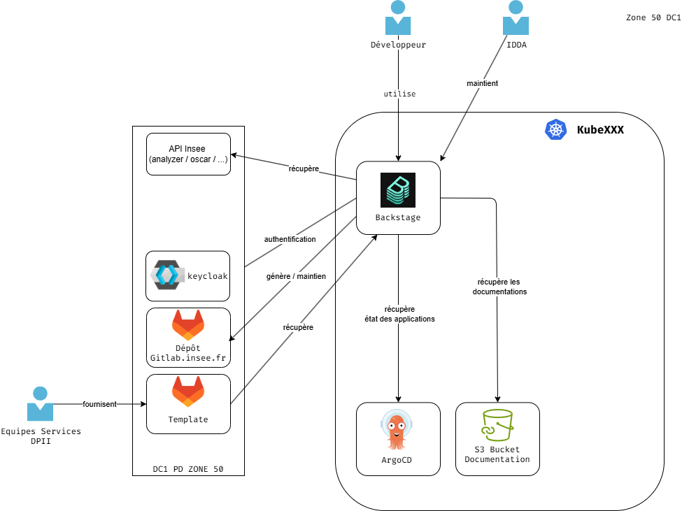

# Les outils testés et POC réalisés

## Backstage

L'Internal Developer Platform (IDP) est le produit exposé aux équipes applicatives ; **Backstage** en est l'implémentation. Il porte les fonctionnalités suivantes :

- **Catalogue logiciel** : inventaire des composants (services, API, ressources, systèmes), alimenté par découverte GitLab. Chaque entité porte ses annotations (dépôt, pipeline, cluster, dashboards).
- **Golden paths (Scaffolder)** : chemins pavés outillés — création d'un service, d'une chart Helm, d'un dépôt GitOps, d'une Claim de ressource. Le Scaffolder ouvre une merge request plutôt qu'un commit direct.
- **TechDocs** : documentation technique versionnée avec le code (MkDocs, et extensions Docusaurus/Hugo).
- **Plugins d'agrégation** : ArgoCD (état de sync), Kubernetes (santé des workloads), Elastic (métriques/alertes), GitLab (pipelines) — la fiche d'un composant réaffiche son état de bout en bout.

L'IDP ne dispose que de **droits de lecture** sur les clusters : il affiche et déclenche, il ne déploie pas. Les écritures sont réservées à ArgoCD et Crossplane.

Pour l'installation et la documentation : https://backstage.io/docs/landing-page/doc-landing-page

Plus d'info: https://gitlab.insee.fr/platform-engineering/architecture-technique/-/blob/main/PlatformEngineering/Architecture-applicative.md?ref_type=heads#linternal-developper-platform

### Architecture (proposée)

L'IDP dispose de **droits d'écriture** uniquement sur Gitlab. L'IDP ne dispose que de **droits de lecture** sur les autres outils : il affiche et déclenche, il ne déploie pas. 

### Les dépôts

- Techdocs-backstage-integration : https://gitlab.insee.fr/platform-engineering/components/techdocs-backstage-integration
- Dépôt de code Backstage : https://gitlab.insee.fr/platform-engineering/poc/portal-dev-exp.
- Déploiement sur KubeDev : https://gitlab.insee.fr/platform-engineering/poc/devexp-gitops/-/tree/master/apps/devexp/dv?ref_type=heads
- Des templates pour le Skaffolder Backstage : https://gitlab.insee.fr/platform-engineering/templates

### A faire

- Packager front et back séparement afin de permettre un déploiement
- Etudier la gestion des droits
- Etudier la possibilité de faire des opérations sur une autre brique sans pour autant avoir un compte générique sur la brique 

## Crossplane

Ce service est le cœur du plan de contrôle : **Crossplane** transforme les besoins d'infrastructure en API internes consommables en self-service.
 
- **XRD (Composite Resource Definitions)** : définissent les API de la plateforme (le « catalogue de ressources » : base, bucket, namespace projet, VM…).
- **Compositions (+ Composition Functions)** : implémentent ces API en assemblant plusieurs ressources managées (une Claim « projet » peut créer namespace + quotas + RBAC + bucket + base + entrée DNS).
- **Claims (CR)** : ce que déclare l'équipe applicative dans son namespace ; versionnées en Git, appliquées par ArgoCD, réconciliées par Crossplane.
- **Providers** : déployés et pilotés par Crossplane (schéma : Crossplane *déploie* le Provider). Un ProviderConfig et un ServiceAccount dédiés par provider, au moindre privilège — jamais de `cluster-admin` global.
- **EnvironmentConfig** : paramètres par tenant et par environnement injectés dans les Compositions.
**Topologie multi-zones** : le Crossplane de la Zone 50 orchestre sa propre zone et scrute/réconcilie la Zone 100 ; chaque zone conserve son contrôleur d'admission (Gatekeeper). Cette séparation limite le rayon d'impact et respecte le découpage réseau en quartiers.
 
**Rôle IDDA** : configure les Compositions et providers ; les capability teams (Équipes Services DPII) étendent le catalogue sur leur domaine. _[À COMPLÉTER — préciser la répartition exacte des responsabilités entre IDDA, Platform Experience et capability teams.]_

Plus d'info : https://gitlab.insee.fr/platform-engineering/architecture-technique/-/blob/main/PlatformEngineering/Architecture-applicative.md?ref_type=heads#service-dorchestratration-de-cr%C3%A9ation-de-plateforme

### Architecture (proposée)

### Les dépôts

- Dépôt module Sugoi : https://gitlab.insee.fr/platform-engineering/poc/crossplane-sugoi
- Dépôt module application : https://gitlab.insee.fr/platform-engineering/poc/crossplane
- Dépôt gitops Crossplane : https://gitlab.insee.fr/kubernetes/kubeqfapp/poc/crossplane

### Autres

- Etudes réalisées par Rayane :
    - https://codimd.dev.kube.insee.fr/HRHrJhZUTvGgjvryVIYMLg# ; 
    - https://codimd.dev.kube.insee.fr/-gpJ0CMvQpW-T1yU5pawMQ?view

## To-be-continous

- Etat des lieux : https://codimd.dev.kube.insee.fr/PFN9gJ_xTTqjaPzgZD7p-Q?view ; 
- Etude réalisée par Rayane : https://codimd.dev.kube.insee.fr/8exdw0tbS1KjwpiqO9XOeQ#

### Les dépôts

- Dépôt components : https://gitlab.insee.fr/platform-engineering/poc/components. On trouve notamment le components pour uploader de la doc mkdocs dans du S3 pour la servir par la suite dans backstage.

## Copier

- https://copier.readthedocs.io/en/stable/

## Kratix

- Etude Réalisée par Rayane :
    - https://codimd.dev.kube.insee.fr/HRHrJhZUTvGgjvryVIYMLg ; 
    - https://codimd.dev.kube.insee.fr/-gpJ0CMvQpW-T1yU5pawMQ