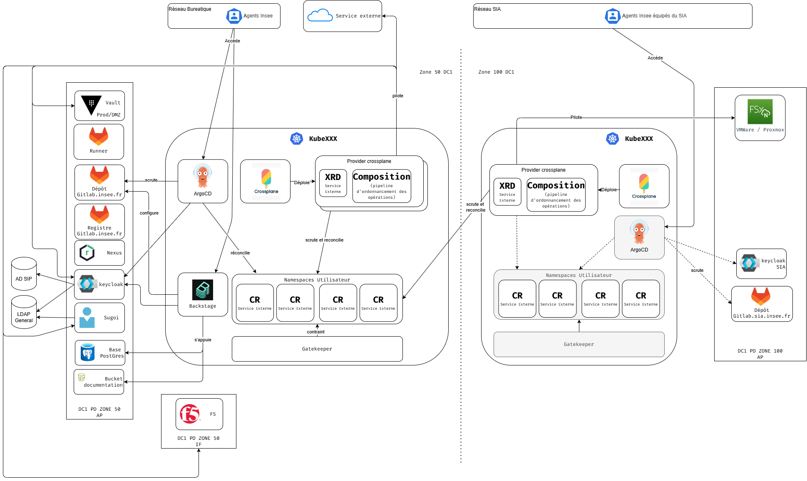
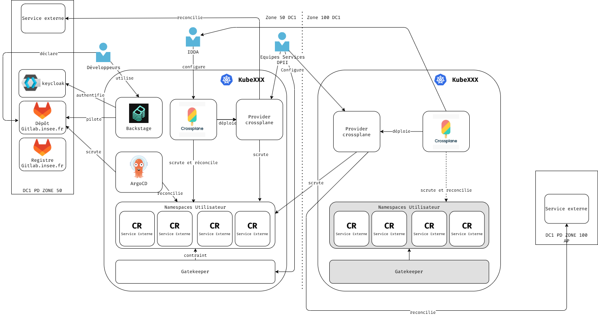

# Architecture applicative

L'architecture applicative de la PFE est organisée selon la **référence CNCF Platform Engineering en cinq plans** (Developer Control · Integration & Delivery · Resource · Monitoring & Logging · Security), eux-mêmes alignés sur l'architecture fonctionnelle ci-dessus. Le Resource Plane est décliné en trois mondes d'exécution (Kubernetes, VM on-prem, cloud souverain).

L'ensemble des briques logicielles est exposé en HTTPS exclusivement.

## Schéma d'architecture applicative

Le schéma technique détaillé est documenté dans le fichier `architecture-applicative.drawio.png` associé. Il représente :

- la **topologie multi-zones** : un cluster de management/contrôle en **Zone 50 DC1** qui porte le portail, la fabrique et le plan de contrôle, et un ou plusieurs clusters d'exécution en **Zone 100 DC1**, chaque zone disposant de son propre contrôleur d'admission ;
- le pattern **Claim → Composite Resource (CR) → Provider → Service Externe** de Crossplane, décliné dans chaque zone.

## Description des briques
Les briques sont présentées par plan CNCF. 

## Description des flux

Les flux non standard significatifs sont les suivants.

## Description des flux

Les flux non standard significatifs sont les suivants. Les flux standard (navigateur → portail en HTTPS, `git push`/`git clone` en HTTPS) ne sont pas listés.

| Origine | Destination | Protocole | Description |
| ------- | ----------- | --------- | ----------- |
| Développeur | Backstage | HTTPS | Utilisation du portail (catalogue, Scaffolder, TechDocs). |
| Backstage | Keycloak | OIDC / HTTPS | Authentification déléguée ; fédération SUGOI. |
| Backstage | Dépôt GitLab | HTTPS (API v4) | Scaffolding : création de dépôt et ouverture de merge request (pilotage). |
| ArgoCD | Dépôt GitLab | HTTPS (git) | Scrute le dépôt GitOps (état désiré). |
| ArgoCD | API Kubernetes (namespaces) | HTTPS (kube-apiserver) | Réconciliation continue du réel vers le désiré. |
| IDDA | Crossplane | HTTPS (kube-apiserver) | Configuration des Compositions / providers / EnvironmentConfig. |
| Équipes Services DPII | Crossplane / Gatekeeper | HTTPS (kube-apiserver) | Configuration des ressources et policies de leur domaine. |
| Crossplane | Provider Crossplane | Interne cluster (gRPC/API) | Déploiement et pilotage des providers. |
| Provider Crossplane | Namespaces Utilisateur (CR) | HTTPS (kube-apiserver) | Scrute les Composite Resources « Service Externe ». |
| Provider Crossplane | Service Externe | API propre à la cible (vSphere, S3, OIDC, DB…) | Réconciliation de la ressource externe déclarée par la Claim. |
| Crossplane (Zone 50) | Cluster Kubernetes (Zone 100) | HTTPS (kube-apiserver distant) | Scrute et réconcilie les ressources d'une autre zone réseau. |
| Gatekeeper | Admission (namespaces) | Webhook interne | Contrainte des ressources à l'admission (refus si non conforme). |
| External Secrets Operator | Vault | HTTPS (auth Kubernetes) | Récupération des secrets et matérialisation en `Secret` dans le namespace. |
| cert-manager | Vault (PKI) / ACME | HTTPS | Émission et renouvellement des certificats TLS. |
| Runners CI | Registre GitLab / Nexus | HTTPS | Publication des images signées et des artefacts. |
| Clusters d'exécution | Stack d'observabilité | HTTPS / OTLP | Remontée des logs, métriques et traces (auto-supervision). |

> Note de cloisonnement : côté monde VM, aucun flux entrant depuis le cluster de management ne joint directement l'hyperviseur. `provider-terraform` **génère** les fichiers dans Git, et un runner situé dans la zone d'administration exécute `terraform apply` ; le retour d'état revient par commit (cf. section suivante).

## L'Internal Developper Platform

L'Internal Developer Platform (IDP) est le produit exposé aux équipes applicatives ; **Backstage** en est l'implémentation. Il porte les fonctionnalités suivantes :

- **Catalogue logiciel** : inventaire des composants (services, API, ressources, systèmes), alimenté par découverte GitLab. Chaque entité porte ses annotations (dépôt, pipeline, cluster, dashboards).
- **Golden paths (Scaffolder)** : chemins pavés outillés — création d'un service, d'une chart Helm, d'un dépôt GitOps, d'une Claim de ressource. Le Scaffolder ouvre une merge request plutôt qu'un commit direct.
- **TechDocs** : documentation technique versionnée avec le code (MkDocs, et extensions Docusaurus/Hugo).
- **Plugins d'agrégation** : ArgoCD (état de sync), Kubernetes (santé des workloads), Grafana (métriques/alertes), GitLab (pipelines) — la fiche d'un composant réaffiche son état de bout en bout.

L'IDP ne dispose que de **droits de lecture** sur les clusters : il affiche et déclenche, il ne déploie pas. Les écritures sont réservées à ArgoCD et Crossplane.

### Gestion des accès et habilitations

On repose sur une authentificiation OIDC basée sur keycloak.

La segmentation des droits est réalisée par l'intermédiaire des groupes AG. Elle est réalisée en interne de backstage avant de réaliser une quelconque opération sur les outils externe

### Fonctionnement

### Critères DICT

:::info

- **Disponibilité** :

  - Impact si critère non respecté : 
  - Dispositif mis en place pour l'atteindre :

:::

:::info

- **Intégrité** :

  - Impact si critère non respecté : 
  - Dispositif mis en place pour l'atteindre : 

:::

:::info

- **Confidentialité** :

  - Impact si critère non respecté : 
  - Dispositif mis en place pour l'atteindre : 

:::

:::info

- **Traçabilité** :

  - Impact si critère non respecté : 
  - Dispositif mis en place pour l'atteindre : 

:::

:::info

- **Sauvegarde** :

  - Impact si critère non respecté : 
  - Dispositif mis en place pour l'atteindre : 

:::

:::info

- **Mises à jour** :

  - Impact si critère non respecté : 
  - Dispositif mis en place pour l'atteindre : 

:::

:::info

- **Supervision** :
  - Impact si critère non respecté : 
  - Dispositif mis en place pour l'atteindre : 

:::

## La fabrique logicielle

Voir DAT Gitlab

## Service d'accès à des ressources externes

Voir DAT Nexus

## Service d'intégration de sécurité dans le développement/déploiement applicatif

Ces services constitue l'ensemble des briques intervenant dans le build applicatif:

- Analyse des CVEs avec trivy
- Analyse de code avec Checkmarx/Sonar
- Signature des livrables avec ????

### Gestion des accès et habilitations

Tenant dédié pour chaque appli + Authentification OIDC

### Fonctionnement

### Critères DICT

:::info

- **Disponibilité** :

  - Impact si critère non respecté : 
  - Dispositif mis en place pour l'atteindre :

:::

:::info

- **Intégrité** :

  - Impact si critère non respecté : 
  - Dispositif mis en place pour l'atteindre : 

:::

:::info

- **Confidentialité** :

  - Impact si critère non respecté : 
  - Dispositif mis en place pour l'atteindre : 

:::

:::info

- **Traçabilité** :

  - Impact si critère non respecté : 
  - Dispositif mis en place pour l'atteindre : 

:::

:::info

- **Sauvegarde** :

  - Impact si critère non respecté : 
  - Dispositif mis en place pour l'atteindre : 

:::

:::info

- **Mises à jour** :

  - Impact si critère non respecté : 
  - Dispositif mis en place pour l'atteindre : 

:::

:::info

- **Supervision** :
  - Impact si critère non respecté : 
  - Dispositif mis en place pour l'atteindre : 

:::

## Service d'orchestratration de création de plateforme

Ce service est le cœur du plan de contrôle : **Crossplane** transforme les besoins d'infrastructure en API internes consommables en self-service.
 
- **XRD (Composite Resource Definitions)** : définissent les API de la plateforme (le « catalogue de ressources » : base, bucket, namespace projet, VM…).
- **Compositions (+ Composition Functions)** : implémentent ces API en assemblant plusieurs ressources managées (une Claim « projet » peut créer namespace + quotas + RBAC + bucket + base + entrée DNS).
- **Claims (CR)** : ce que déclare l'équipe applicative dans son namespace ; versionnées en Git, appliquées par ArgoCD, réconciliées par Crossplane.
- **Providers** : déployés et pilotés par Crossplane (schéma : Crossplane *déploie* le Provider). Un ProviderConfig et un ServiceAccount dédiés par provider, au moindre privilège — jamais de `cluster-admin` global.
- **EnvironmentConfig** : paramètres par tenant et par environnement injectés dans les Compositions.
**Topologie multi-zones** : le Crossplane de la Zone 50 orchestre sa propre zone et scrute/réconcilie la Zone 100 ; chaque zone conserve son contrôleur d'admission (Gatekeeper). Cette séparation limite le rayon d'impact et respecte le découpage réseau en quartiers.
 
**Rôle IDDA** : configure les Compositions et providers ; les capability teams (Équipes Services DPII) étendent le catalogue sur leur domaine. _[À COMPLÉTER — préciser la répartition exacte des responsabilités entre IDDA, Platform Experience et capability teams.]_

### Gestion des accès et habilitations

- Pour les fournisseurs:
  * Dépôt dédiés + tenant dédiés dans ArgoCD, réduction du type de ressources déployable au strict minimun
- Pour les utilisateurs:
  * Possibilités de déployer des ressources uniquement dans leur namespace. Champs validé / restreint par l'intermédiaire de gatekeeper

### Fonctionnement

### Critères DICT

:::info

- **Disponibilité** :

  - Impact si critère non respecté : 
  - Dispositif mis en place pour l'atteindre :

:::

:::info

- **Intégrité** :

  - Impact si critère non respecté : 
  - Dispositif mis en place pour l'atteindre : 

:::

:::info

- **Confidentialité** :

  - Impact si critère non respecté : 
  - Dispositif mis en place pour l'atteindre : 

:::

:::info

- **Traçabilité** :

  - Impact si critère non respecté : 
  - Dispositif mis en place pour l'atteindre : 

:::

:::info

- **Sauvegarde** :

  - Impact si critère non respecté : 
  - Dispositif mis en place pour l'atteindre : 

:::

:::info

- **Mises à jour** :

  - Impact si critère non respecté : 
  - Dispositif mis en place pour l'atteindre : 

:::

:::info

- **Supervision** :
  - Impact si critère non respecté : 
  - Dispositif mis en place pour l'atteindre : 

:::
