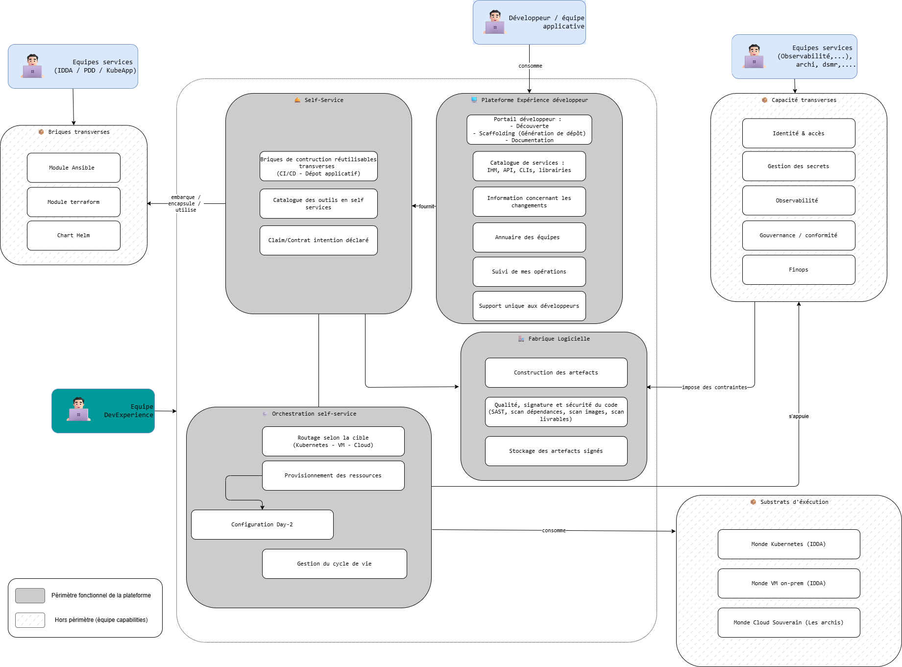

# Architecture fonctionnelle

L'architecture fonctionnelle de la PFE décrit les capacités offertes aux équipes applicatives de l'Insee, indépendamment de leur implémentation technique.

## Description des acteurs

### Clients/Utilisateurs

Un client/utilisateur est une personne, une application ou une entité qui utilise la plateforme.

**Clients/Utilisateurs internes à l'Insee**

| Applications | Description | Rôle |
|---|---|---|
| Applications du SI Insee | Workloads hébergés sur les substrats fournis par la PFE | Consommateurs des capacités de provisioning, déploiement, observabilité |
| Plateform IA | Utilisation du produit platformengineering | Consommateur interne (peut s'appuyer sur la documentation + les APIs) |

| Utilisateurs | Description | Rôle |
|---|---|---|
| Développeurs des équipes applicatives | ≈ 250 développeurs répartis sur l'ensemble du SI | Utilisateurs principaux du portail, du catalogue et des golden paths |
| Les Ops réalisant des tâches de développement | ≈ 200 ops répartis sur l'ensemble du SI | Utilisateurs du portail, du catalogue et des golden paths |
| Les équipes services du DPII (capabilities team) | ≈ 200 ops répartis sur l'ensemble du SI | Producteurs de Compositions et de modules, et consommateurs de la plateforme pour leurs propres outillages |
| Équipe DevExperience | Propriétaire du produit / SI PlatformExperience | Administrateurs de la plateforme |
| Autres équipes transverses (DSMR/Architecte/Urbanisation) | Discovery du SI, suivi des indicateurs,... | Audits, conseils, ... |

**Clients/Utilisateurs externes à l'Insee**

| Applications | Description | Rôle |
|---|---|---|
| _Aucune_ | La PFE n'est pas exposée à l'extérieur du SI Insee | — |

| Utilisateurs | Description | Rôle |
|---|---|---|
| _Aucun_ | La PFE est strictement interne | — |

### Fournisseurs de données

**Fournisseurs internes à l'Insee**

| Applications | Description | Rôle |
|---|---|---|
| SI Sugoi | Référentiel d'identités Insee | Source de vérité des identités et groupes (stockés dans LDAP AG fédéré dans Keycloak) |
| Gitlab | Forge logicielle | Source de vérité où sont stockés les sites documentaires, les modules applicatifs, les modules,...   |
| Nexus | Stockage et mirroring des artefacts | Stocker et accéder aux artefacts externe |

| Utilisateurs | Description | Rôle |
|---|---|---|
| Équipe DevExperience | — | Production des Compositions, templates, configurations |
| Les équipes services du DPII (capabilities team) | — | Production de modules et services exposés via la plateforme |
| DAD / développeurs | — | Production de templates de dépôts de code / implémentation des bonnes pratiques de codes |
| Architectes | — | Source des patterns applicatifs à implémenter |
| DSMR | — | Source des politiques sécurité à implémenter |

**Fournisseurs externes à l'Insee**

| Applications | Description | Rôle |
|---|---|---|
| Registres publics de paquets (npm, PyPI, Maven Central, Docker Hub, GitHub Container Registry, Helm Hub…) | Sources de dépendances logicielles | Approvisionnement *via miroirs Nexus internes* — aucune sortie directe depuis les workloads |
| Fournisseur de cloud souverain (cible) | À déterminer (cf. ADR-PLATFORM-003) | Substrat d'exécution cible à moyen terme |

| Utilisateurs | Description | Rôle |
|---|---|---|
| _Aucun_ | — | — |

## Schéma d'architecture fonctionnelle

L'architecture fonctionnelle est organisée en quatre blocs fonctionnels et un ensemble de capacités transverses.

### Comment lire le schéma

Le schéma d'architecture fonctionnelle est organisé en **sept grandes briques**, dont la lecture suit une double grille :

- **Le code visuel** distingue ce qui relève du **périmètre fonctionnel de la plateforme** (cases au fond gris uni) de ce qui n'en relève pas (cases au fond blanc, attribuées aux autres équipes services).
- **Les flèches étiquetées** (`consomme`, `fournit`, `embarque`, `utilise`, `impose des contraintes`, `s'appuie`) qualifient la nature de chaque relation entre briques, il ne s'agit pas seulement de dépendances techniques, mais de **responsabilités fonctionnelles**.

Ce double codage matérialise le principe central du modèle Team Topologies appliqué à l'Insee : **la plateforme est un canal de distribution, pas un atelier de production universel**. Elle expose, assemble et industrialise des services produits par d'autres, sans s'arroger leur expertise.

### Synthèse du périmètre

| Bloc | Périmètre | Propriétaire |
|---|---|---|
| Plateforme Expérience développeur | ✅ Dans le périmètre plateforme | Équipe DevExperience |
| Self-Service | ✅ Dans le périmètre plateforme | Équipe DevExperience |
| Fabrique Logicielle | ✅ Dans le périmètre plateforme | Équipe DevExperience |
| Orchestration self-service | ✅ Dans le périmètre plateforme | Équipe DevExperience |
| Briques transverses | ❌ Hors périmètre plateforme | Capability teams (Data, Infra VM, Sécurité…) |
| Capacités transverses | ❌ Hors périmètre plateforme | Capability teams (IAM, Sécurité, Observabilité, FinOps) |
| Substrats d'exécution | ❌ Hors périmètre plateforme | Équipes d'infrastructure (DSI, Réseau, Cloud) |

### Les briques dans le périmètre de la plateforme

#### Plateforme Expérience développeur

C'est **le visage de la plateforme**. Tout ce que le développeur voit, touche, parcourt, il ne devrait jamais avoir à descendre en dessous de cette couche pour faire son travail courant.

##### Sous-cases

- **Service Portail développeur**, point d'entrée unique combinant trois fonctions : *Découverte* (explorer ce que la plateforme propose), *Scaffolding* (générer un nouveau projet à partir d'un template, avec dépôt Git, pipeline et droits préconfigurés), *Documentation* (TechDocs centralisée et toujours à jour).
- **Service Catalogue de services**, recensement de tout ce qui existe et qui est consommable : IHM, API, CLI, librairies. Ce qui n'est pas dans le catalogue n'existe pas.
- **Service Information concernant les changements**, communication produit sur les évolutions, les dépréciations, les incidents. La plateforme étant un produit utilisé par des centaines de personnes, sa communication doit être traitée comme une fonction à part entière.
- **Service Annuaire des équipes**, qui possède quoi, qui contacter pour quel service. C'est ce qui rend visible la *propriété* dans un SI où elle est habituellement diluée.
- **Service Suivi de mes opérations**, restitution des actions en cours et passées du développeur (Claims posées, déploiements, demandes). Sans cette visibilité, le self-service devient une boîte noire.
- **Service Support unique aux développeurs**, un canal unique de contact, quel que soit le sujet. Charge à la plateforme de router en interne vers la bonne capability team si nécessaire.

#### Self-Service

Le bloc qui transforme une intention exprimée par le développeur en une **action exécutable et industrialisée**. C'est le cœur technique du contrat plateforme.

##### Sous-cases

- **Service Briques de construction réutilisables transverses (CI/CD, dépôt applicatif)**, templates de pipelines GitLab CI, structures de dépôts standardisées, snippets réutilisables. Ce sont les *building blocks transverses* (pas spécifiques à un domaine) que la plateforme produit elle-même.
- **Service Catalogue des outils en self-service**, l'exposition de l'offre : "voici ce que tu peux demander, voici les paramètres, voici ce que ça implique". Sans ce catalogue, le développeur ne peut pas formuler de demande utile.
- **Service Claim / Contrat d'intention déclaré**, la matérialisation déclarative d'une demande. Le développeur écrit *ce qu'il veut*, jamais *comment le produire*. C'est le contrat-pivot qui découple l'intention de l'implémentation.

À noter : ce bloc *utilise* les briques produites par les équipes services de la production (Helm, Terraform, Ansible, API, script (si pas le choix)), il ne les *produit pas*. C'est la flèche `embarque / encapsule / utilise` qui matérialise cette relation.

#### Fabrique Logicielle

Le bloc qui **transforme le code en artefact prêt à déployer**, avec les contrôles de qualité et sécurité associés.

##### Sous-cases

- **Service Construction des artefacts**, orchestration des jobs CI : build, tests, packaging. Mutualise les pipelines pour que chaque équipe n'écrive pas son `.gitlab-ci.yml` à partir de zéro.
- **Service Qualité, signature et sécurité du code**, analyse statique (SAST), scan des dépendances, scan des images de conteneurs, scan des livrables. Et signature cryptographique (cosign / Sigstore) pour garantir l'intégrité de bout en bout.
- **Service Stockage des artefacts signés**, registre central des images, paquets, charts. Source unique de vérité de ce qui peut être déployé.
La fabrique est le lieu où s'incarnent les exigences d'intégrité et de conformité de l'entrée en production.
- **Service de Stockage du code applicatif**: forge contenant le code source des applications clientes du SI PlatformExperience.

Sa relation `impose des contraintes` avec les équipes services est lisible dans les deux sens : la fabrique applique des règles définies ailleurs (politique sécurité, conformité, IAM), mais elle est *l'outilleur* qui rend ces règles effectivement appliquées sans friction côté développeur. C'est ce qui distingue *avoir une politique sécurité* (n'importe quelle DSMR en a une) de *l'appliquer systématiquement* (ce que seule une fabrique outillée permet à l'échelle de 250 développeurs).

#### Orchestration self-service

Le bloc qui **exécute** une Claim : route la demande vers le bon moteur, provisionne, configure, et accompagne la ressource tout au long de sa vie. C'est le bloc le plus central de la plateforme (bien que non visible). C'est lui qui permet d'abstraire la complexité, d'imposer des règles. 

##### Sous-cases

- **Routage selon la cible (Kubernetes, VM, Cloud)**, choix du moteur d'exécution (Crossplane, Terraform/OpenTofu, Ansible) en fonction des paramètres de la Claim. Le développeur ne voit jamais cette bifurcation.
- **Provisionnement des ressources**, création effective de la ressource demandée (cluster, VM, base, bucket…). C'est la mécanique GitOps qui s'enclenche sur la base de la Claim.
- **Configuration Day-2**, configuration immédiate post-provisioning (installation d'agents, application de rôles Ansible, premières conventions de durcissement). Typiquement pour le monde VM.
- **Gestion du cycle de vie**, capacité essentielle souvent omise : mise à jour, redimensionnement, archivage, suppression propre. La vraie valeur du self-service n'est pas seulement de *créer*, c'est aussi de pouvoir *faire évoluer* sans procédure ticket.

Sa relation `consomme` avec les Substrats d'exécution est explicite : la plateforme *utilise* les substrats fournis par les équipes d'infrastructure, elle ne les *opère* pas.

### Les briques hors du périmètre de la plateforme

C'est la partie du schéma qui formalise un choix d'architecture organisationnelle structurant : **la plateforme ne s'arroge pas l'expertise des autres équipes**. Trois grandes catégories sont explicitement positionnées hors périmètre.

#### Briques transverses (Module Ansible, Module Terraform, Chart Helm)

Ce sont les **composants spécifiques aux domaines techniques** : chart Helm applicatif standard, modules Terraform pour le provisioning d'infrastructure, rôles Ansible pour la configuration des VM.

##### Pourquoi ces briques sont hors périmètre

Parce qu'elles **encodent une expertise de domaine** que l'équipe Platform Experience n'a pas, et qu'elle ne peut pas raisonnablement avoir, sauf à devenir experte dans tous les domaines techniques du SI (Postgres, réseau, OS, sécurité applicative, messagerie…).

Concrètement :

- Le **chart Helm applicatif standard** doit encoder les bonnes pratiques de déploiement Kubernetes, les conventions d'observabilité, les pratiques de sécurité runtime, il est co-produit par les capability teams concernées (Observabilité, Sécurité).
- Les **modules Terraform** pour le provisioning VM ou cloud doivent encoder l'expertise infrastructure (dimensionnement, réseau, durcissement OS), ils sont produits par la capability team Infra.
- Les **rôles Ansible** standards (installation d'agents, durcissement, conformité OS) sont produits par la capability team Infra VM.

La relation `embarque / encapsule / utilise` avec le bloc Self-Service est claire : la plateforme **consomme** ces briques produites ailleurs, les **distribue** via son Self-Service au développeur, et **garantit qu'elles s'intègrent** dans son golden path. Mais elle ne les produit pas.

Cette répartition obéit à un principe simple : **plus une brique encode une expertise de domaine, plus elle appartient à la capability team correspondante**. La plateforme reste propriétaire des seules briques *vraiment transverses* (templates CI/CD, scaffolding), celles qui n'appartiennent à personne d'autre.

#### Capacités transverses (Identité, Secrets, Observabilité, Gouvernance, FinOps)

Ce sont des **fonctions à dimension institutionnelle** qui dépassent le périmètre d'un produit plateforme.

##### Pourquoi ces capacités sont hors périmètre

Pour chacune, la raison est légèrement différente, mais le principe est commun :

- **Identité & accès**, la politique d'identité Insee (SUGOI, fédération, MFA, durée de session) est définie par la fonction Sécurité du SI etr implémenté par IAHS, pas par la plateforme. La plateforme *consomme* cette politique via Keycloak, elle ne la *décide* pas.
- **Gestion des secrets**, la politique de gestion des secrets (rotation, classification, audit) relève de la fonction Sécurité (IAHS + DSMR). La plateforme utilise les outils (Vault + External Secrets Operator) pour rendre la politique applicable, mais n'en est pas l'autorité ni la maintenicienne.
- **Observabilité**, la capability team Observabilité produit et opère la stack (Elastic), définit les conventions de logs et métriques, maintient les bibliothèques d'instrumentation.
- **Gouvernance / conformité**, relève de la DSMR (PES existante) et de la gouvernance SI Insee. La plateforme implémente les politiques (via policy-as-code par exemple) mais ne les arbitre pas.
- **FinOps**, la fonction FinOps (suivi des coûts, allocations, prévisions) est une discipline transversale du SI, pas une fonction de la plateforme. La plateforme expose les données de consommation, le FinOps les exploite...

La relation `impose des contraintes` (vers Fabrique) et `s'appuie` (vers Orchestration) capture cette double dynamique : ces capacités **dictent les règles** que la plateforme doit appliquer, et **fournissent les services** sur lesquels la plateforme repose. La plateforme est leur *intégrateur*, jamais leur *propriétaire*.

Conséquence pratique forte : l'équipe Platform Experience travaille **en partenariat étroit** avec ces capability teams, mais ne se substitue pas à elles. Quand un développeur a une question profonde sur la sécurité applicative, la plateforme l'**oriente** vers la capability team IAHS ; elle ne tranche pas elle-même.

#### Substrats d'exécution (Monde Kubernetes, Monde VM on-prem, Monde Cloud Souverain)

Ce sont les **environnements physiques et logiques** sur lesquels les workloads s'exécutent.

##### Pourquoi ces substrats sont hors périmètre

Parce qu'ils relèvent des **équipes d'opération avec de l'expertise sur l'infrastructure** : exploitation des clusters Kubernetes (IDDA + KubeSocle + réseau + ....), gestion du parc VM (IDDA + Système + ...), contractualisation et opération du futur cloud souverain (« Les archis », architectes en charge du choix cible).

La plateforme **consomme** ces substrats comme des services : elle déploie ses workloads sur les clusters Kubernetes, demande des VM au parc IDDA, demandera demain des ressources sur le cloud souverain. Mais elle n'a pas vocation à opérer ces substrats, le ferait-elle qu'elle dupliquerait des compétences déjà présentes ailleurs dans l'organisation et brouillerait les responsabilités d'exploitation.

L'intérêt fonctionnel de l'avoir représenté dans le schéma, bien que hors périmètre, est de matérialiser la **cible-agnosticité** du contrat Claim : trois mondes en aval, un seul contrat en amont. C'est cette propriété qui rend la migration cloud future possible sans réécriture applicative.

### Lecture des relations entre blocs

Les flèches du schéma ne sont pas des dépendances techniques mais des **relations de responsabilité** :

| Relation | Sens fonctionnel |
|---|---|
| Développeur **consomme** Plateforme Expérience développeur | Le développeur n'interagit qu'avec cette couche ; tout le reste est servi |
| Plateforme Expérience développeur ← **fournit** ← Self-Service | Le portail expose ce que le Self-Service met à disposition |
| Self-Service **embarque / encapsule / utilise** Briques transverses | La plateforme distribue les briques produites par les capability teams |
| Self-Service **utilise** Fabrique Logicielle et Orchestration | Le Self-Service est le pivot qui mobilise les autres blocs |
| Fabrique Logicielle ← **impose des contraintes** ← Capacités transverses | Les capacités transverses dictent les règles que la fabrique applique |
| Orchestration **s'appuie** sur Capacités transverses | L'orchestration utilise les services fournis par les capability teams |
| Orchestration **consomme** Substrats d'exécution | La plateforme n'opère pas les substrats, elle les utilise |

Cette grille de lecture, plus que la liste des briques, est le **vrai contenu d'architecture** du schéma. Elle dit qui dépend de qui, qui fournit quoi à qui, et, implicitement, où sont les frontières de responsabilité au sein du SI.

## Description d'un cycle de vie

Le cycle de vie d'usage de référence est celui d'une **application** au sein de la PFE. Trois phases jalonnent ce cycle.

**Phase 1 — Démarrage du projet (jour J)**

Le développeur ouvre le portail, choisit un template adapté à son cas d'usage, renseigne quelques paramètres (nom, équipe, dimensionnement). La plateforme provisionne automatiquement le dépôt Git, le pipeline CI, le catalogue, le dashboard de monitoring vide, les droits d'accès via Keycloak/SUGOI. Le développeur dispose d'un projet prêt à coder en moins d'une heure.

**Phase 2 — Vie courante (J+1 à J+N)**

Le développeur code, commite, pousse. La fabrique logicielle (CI) construit, scanne (SAST, dépendances, images), signe et publie les artefacts. À chaque merge sur la branche principale, l'application est déployée par GitOps (ArgoCD) dans l'environnement applicatif cible. Les ressources d'infrastructure complémentaires (bases, buckets, files de messages) sont obtenues à la demande via des Claims, sans intervention de l'équipe plateforme.

**Phase 3 — Évolution et sortie de production (J+N+M)**

L'application évolue (mise à l'échelle, ajout de ressources, changement de quartier réseau) par modification de ses Claims. La sortie de production est instruite par suppression contrôlée des objets correspondants : les ressources sont déprovisionnées proprement, l'archive Git est conservée pour traçabilité, le service est retiré du catalogue.

> *Note* — La PFE elle-même, en tant que produit, suit son propre cycle d'évolution continu (releases, mises à jour de Compositions, ajout de templates) géré par l'équipe Platform Experience et indépendant des cycles applicatifs.

## Besoins non fonctionnels

L'enjeu de la PFE pour l'Insee est qualifié d'**indispensable** : à mesure que les équipes applicatives basculent sur la plateforme, leur capacité à livrer, exploiter, faire évoluer leurs services en dépend directement. Une indisponibilité prolongée de la PFE entraînerait l'arrêt de toute nouvelle livraison sur le SI Insee, sans pour autant interrompre les applications déjà déployées (qui continuent à tourner sur leurs substrats indépendants).

### Disponibilité

La PFE est qualifiée de **système indispensable**. Les besoins de disponibilité varient toutefois selon les composants :

- **Composants critiques** : 
    - Hors périmètre SI PlatformExperience: Vault, Keycloak, stack d'observabilité. Sans ces composants le SI PlatformExperience risque de ne plus pouvoir assurer son role. 
    - Dans le périmètre du SI PlatformExperience:  Crossplane, Nexus, ArgoCD, GitLab. indisponibilité maximale tolérable de 1/2 journée ouvrée. Ces composants sont à la base du fonctionnement du SI PlatformExperience. Au-delà risque de blocage de l'ensemble des livraisons SI.

- **Composants importants**: Backstage indisponibilité tolérable jusqu'à 24 heures, les workflows critiques pouvant être contournés en dégradé, les templates pouvant être utilisé en direct, les environnements déjà déployés continus de fonctionner 
- **Composants secondaires** (FinOps, dashboards non opérationnels) : indisponibilité tolérable de plusieurs jours.

### Intégrité

L'intégrité des artefacts et de la configuration déployée est **critique**. Le code qui s'exécute en production doit être exactement celui qui a été commité, revu et approuvé. Les mécanismes pouvant garantir l'intégrité sont :

- signature des artefacts (cosign / Sigstore) et vérification à l'admission;
- génération et conservation des SBOM ;
- GitOps comme source de vérité unique (toute modification passe par Git, historisée et signée) ;
- policy-as-code (Kyverno/OPA) refusant l'admission de ressources non conformes ;
- audit logs immuables des opérations sur la plateforme.

### Confidentialité

Le niveau de confidentialité retenu est **Diffusion Restreinte**, pour les raisons suivantes :

- les outils de la PFE pourrait avoir à consommer les secrets opérationnels (via Vault) qui ouvrent l'accès aux applications de production de l'Insee ;
- les applications déployées par le biais de la platform peuvent avoir à consommer des secrets ;
- la configuration GitOps décrit la topologie complète du SI applicatif ;
- la compromission de la PFE constituerait un pivot d'attaque vers l'ensemble du SI.

En conséquence, l'accès à la PFE et à sa configuration est strictement réservé aux équipes Insee habilitées, par authentification forte (SSO Keycloak fédéré avec SUGOI + MFA (??)), avec RBAC fin par espace de noms et par dépôt.

### Traçabilité

Le besoin de traçabilité est **élevé**. Par construction GitOps, toute modification de l'état du système est portée par un commit signé, daté, attribué à un auteur identifié — ce qui fournit un journal d'audit natif. Complètent ce socle :

- les logs centralisés des outils de la plateforme (ArgoCD, Crossplane, Vault, Keycloak, Backstage) ;
- les audit logs Kubernetes ;
- la conservation de l'historique Git sans purge automatique.

**La rétention cible des journaux d'audit est fixée à 12 mois en chaud + archivage à valeur de preuve selon les exigences de DSMR — à confirmer.**

### Besoin de sauvegardes / purges de données

La PFE dispose de plusieurs sources de vérité dont la sauvegarde doit être organisée :

- **Dépôts Git (GitLab)** => sauvegarde quotidienne à minima
- **Coffre-fort de secrets (Vault)** => => sauvegarde à chaque changement de secrets ?
- **Bases de métadonnées (Backstage, Keycloak, Nexus)** => sauvegarde quotidienne, backstage consomme gitlab on peut le perdre, il sera juste plus lent à revenir.

### Besoin de supervision

La PFE se supervise elle-même avec sa propre stack (auto-consommation). Le niveau de service attendu impose :

- supervision QoS classique (santé des composants, disponibilité des endpoints) ;
- supervision QoE (parcours utilisateur synthétique : "un dev arrive-t-il à scaffolder un projet et obtenir un déploiement en moins de N minutes ?") ;
- alerting 24/7 sur les composants critiques (Vault, Keycloak, ArgoCD core), avec astreinte ;
- alerting heures ouvrées sur les composants importants.

### Besoin de performance / tenue à la charge

La cible de dimensionnement à 36 mois est l'usage par les ≈ 250 développeurs du SI Insee, avec les ordres de grandeur suivants :

- jusqu'à 250 développeurs actifs simultanément sur le portail aux heures de pointe;
- plusieurs centaines de pipelines CI/CD exécutés par jour;
- plusieurs milliers d'objets gérés (services catalogués, ressources Crossplane, applications ArgoCD).

Les composants doivent supporter ces charges en régime nominal avec marge, et résister à des pics ponctuels (sorties de release majeure, correction failles sécurités sur l'ensemble des projets, ...).
